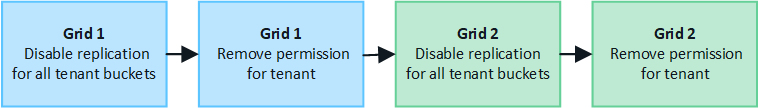

= グリッドフェデレーションに許可されたテナントを管理します
:allow-uri-read: 
:icons: font
:imagesdir: ../media/

[role="lead"]
S3テナントアカウントに、2つのStorageGRIDシステム間のグリッドフェデレーション接続の使用を許可できます。テナントが接続の使用を許可されている場合は、テナントの詳細を編集したり、接続を使用するテナントの権限を完全に削除したりするための特別な手順が必要です。

.開始する前に
* いずれかのグリッドで、を使用してGrid Managerにサインインしておきlink:../admin/web-browser-requirements.html["サポートされている Web ブラウザ"]ます。
* サインインしているグリッドのがlink:admin-group-permissions.html["rootアクセス権限"]必要です。
* 2つのグリッドの間にありますlink:grid-federation-create-connection.html["グリッドフェデレーション接続を作成しました"]。
* とのワークフローを確認しておきlink:grid-federation-what-is-account-clone.html["アカウントのクローン"]link:grid-federation-what-is-cross-grid-replication.html["グリッド間レプリケーション"]ます。
* 必要に応じて、接続内の両方のグリッドに対してシングルサインオン（SSO）または識別フェデレーションがすでに設定されている。を参照して link:grid-federation-what-is-account-clone.html["アカウントクローンとは何ですか"]

== 許可されたテナントを作成します

新規または既存のテナントアカウントがアカウントのクローニングおよびグリッド間レプリケーションにグリッドフェデレーション接続を使用できるようにする場合は、またはlink:editing-tenant-account.html["テナントアカウントを編集する"]への一般的な手順に従って、link:creating-tenant-account.html["新しいS3テナントを作成します"]次の点に注意してください。

* テナントは、接続のどちらのグリッドからも作成できます。テナントが作成されるグリッドは、_tenantのソースグリッド_です。
* 接続のステータスは* connected *である必要があります。
* テナントを作成または編集して* Use grid federation connection *権限を有効にし、最初のグリッドに保存すると、同じテナントが自動的にもう一方のグリッドにレプリケートされます。テナントがレプリケートされているグリッドは、_テナントのデスティネーショングリッド_です。
* 両方のグリッドのテナントには、同じ20桁のアカウントID、名前、概要 、クォータ、および権限が割り当てられます。必要に応じて、*概要 *フィールドを使用して、ソーステナントとデスティネーションテナントを特定できます。たとえば、Grid 1に作成されたテナントの概要 は、Grid 2にレプリケートされたテナントの「This tenant was created on Grid 1」にも表示されます。
* セキュリティ上の理由から、ローカルrootユーザのパスワードはデスティネーショングリッドにコピーされません。
+

TIP: ローカルrootユーザがデスティネーショングリッドでレプリケートされたテナントにサインインできるようにするには、そのグリッドのグリッド管理者が事前に必要ですlink:changing-password-for-tenant-local-root-user.html["ローカルrootユーザのパスワードを変更します"]。

* 新しいテナントまたは編集したテナントが両方のグリッドで利用可能になると、テナントユーザは次の処理を実行できます。
+
** テナントのソースグリッドから、グループとローカルユーザを作成します。これらのユーザは、テナントのデスティネーショングリッドに自動的にクローニングされます。を参照して link:../tenant/grid-federation-account-clone.html["テナントグループとテナントユーザのクローンを作成します"]
** 新しいS3アクセスキーを作成します。このアクセスキーは、必要に応じてテナントのデスティネーショングリッドにクローニングできます。を参照して link:../tenant/grid-federation-clone-keys-with-api.html["APIを使用してS3アクセスキーをクローニングします"]
** 接続の両方のグリッドに同一のバケットを作成し、一方向または両方向のグリッド間レプリケーションを有効にします。を参照して link:../tenant/grid-federation-manage-cross-grid-replication.html["グリッド間レプリケーションを管理します"]

== 許可されたテナントを表示します

グリッドフェデレーション接続の使用が許可されているテナントの詳細を確認できます。

.手順
. *テナント*を選択します。
. [Tenants]ページで、テナント名を選択してテナントの詳細ページを表示します。
+
テナントのソースグリッド（テナントがこのグリッドで作成された場合）の場合は、テナントが別のグリッドにクローニングされたことを通知するバナーが表示されます。このテナントを編集または削除すると、変更内容は他のグリッドに同期されません。

+
image::../media/grid-federation-tenant-detail.png[[Tenant details]ページの[Grid federation]タブ]

. 必要に応じて、* Grid federation *タブをに選択しますlink:../monitor/grid-federation-monitor-connections.html["グリッドフェデレーション接続を監視します"]。

== 許可されたテナントを編集します

Use grid federation connection *権限があるテナントを編集する必要がある場合は、の一般的な手順に従って、link:editing-tenant-account.html["テナントアカウントを編集しています"]次の点に注意してください。

* テナントに* Use grid federation connection *権限がある場合は、接続内のいずれかのグリッドからテナントの詳細を編集できます。ただし、変更内容は他のグリッドにはコピーされません。テナントの詳細をグリッド間で同期させる場合は、両方のグリッドで同じ編集を行う必要があります。
* テナントを編集しているときは、*[Use grid federation connection]*権限をクリアできません。
* テナントの編集中に別のグリッドフェデレーション接続を選択することはできません。

== 許可されたテナントを削除します

Use grid federation connection *権限が割り当てられているテナントを削除する必要がある場合は、の一般的な手順に従って、link:deleting-tenant-account.html["テナントアカウントを削除しています"]次の点に注意してください。

* ソースグリッドから元のテナントを削除する前に、ソースグリッドからアカウントのすべてのバケットを削除する必要があります。
* デスティネーショングリッドからクローンテナントを削除する前に、デスティネーショングリッドからアカウントのすべてのバケットを削除する必要があります。
* 元のテナントまたはクローニングされたテナントを削除すると、そのアカウントをグリッド間レプリケーションに使用できなくなります。
* ソースグリッドから元のテナントを削除しても、デスティネーショングリッドにクローニングされたテナントグループ、ユーザ、またはキーは影響を受けません。クローニングされたテナントを削除するか、テナントによる独自のグループ、ユーザ、アクセスキー、およびバケットの管理を許可することができます。
* デスティネーショングリッドでクローニングされたテナントを削除すると、元のテナントに新しいグループまたはユーザが追加されるとクローニングエラーが発生します。
+
このエラーを回避するには、このグリッドからテナントを削除する前に、グリッドフェデレーション接続を使用するテナントの権限を削除してください。

== [[remove-grid-federation-connection-permission]]グリッドフェデレーション接続の使用権限の削除

テナントがグリッドフェデレーション接続を使用できないようにするには、* Use grid federation connection *権限を削除する必要があります。

グリッドフェデレーション接続を使用するテナントの権限を削除する前に、次の点に注意してください。

* テナントのバケットでグリッド間レプリケーションが有効になっている場合は、* Use grid federation connection *権限を削除できません。テナントアカウントでは、まずすべてのバケットでグリッド間レプリケーションを無効にする必要があります。
* [Use grid federation connection]*権限を削除しても、グリッド間ですでにレプリケートされている項目は削除されません。たとえば、テナントの権限が削除されても、両方のグリッドに存在するテナントユーザ、グループ、およびオブジェクトはどちらのグリッドからも削除されません。これらのアイテムを削除する場合は、両方のグリッドから手動で削除する必要があります。
* 同じグリッドフェデレーション接続でこの権限を再度有効にする場合は、先にデスティネーショングリッドでこのテナントを削除してください。そうしないと、この権限を再度有効にするとエラーが発生します。

NOTE: [Use grid federation connection]権限を再度有効にすると、ローカルグリッドがソースグリッドになり、選択したグリッドフェデレーション接続で指定されたリモートグリッドへのクローニングがトリガーされます。テナントアカウントがリモートグリッドにすでに存在する場合、クローニングで競合エラーが発生します。

.開始する前に
* を使用しているlink:../admin/web-browser-requirements.html["サポートされている Web ブラウザ"]。
* 両方のグリッド用にが用意されていlink:admin-group-permissions.html["rootアクセス権限"]ます。

=== テナントバケットのレプリケーションを無効にする

最初に、すべてのテナントバケットでグリッド間レプリケーションを無効にします。

.手順
. いずれかのグリッドから、プライマリ管理ノードからGrid Managerにサインインします。
. *構成* > *システム* > *グリッド フェデレーション* を選択します。
. 接続名を選択して詳細を表示します。
. [Permitted Tenants]*タブで、テナントが接続を使用しているかどうかを確認します。
. テナントが表示されている場合は、接続内の両方のグリッド上のすべてのバケットに対してテナントに指示しlink:../tenant/grid-federation-manage-cross-grid-replication.html["グリッド間レプリケーションを無効にします"]ます。
+

TIP: テナントバケットでグリッド間レプリケーションが有効になっている場合は、* Use grid federation connection *権限を削除することはできません。テナントは、両方のグリッドでバケットのグリッド間レプリケーションを無効にする必要があります。

=== テナントの権限を削除します

テナントバケットでグリッド間レプリケーションを無効にしたら、グリッドフェデレーション接続を使用するテナントの権限を削除できます。

.手順
. プライマリ管理ノードからGrid Managerにサインインします。
. [Grid Federation]ページまたは[Tenants]ページから権限を削除します。
+
[role="tabbed-block"]
====
.グリッドフェデレーションページ
--
.. *構成* > *システム* > *グリッド フェデレーション* を選択します。
.. 接続名を選択して詳細ページを表示します。
.. [Permitted Tenants]*タブで、テナントのラジオボタンを選択します。
.. [Remove Permission]*を選択します。

--
.テナントページ
--
.. *テナント*を選択します。
.. テナントの名前を選択して詳細ページを表示します。
.. [グリッドフェデレーション]*タブで、接続のラジオボタンを選択します。
.. [Remove Permission]*を選択します。

--
====
. 確認ダイアログボックスで警告を確認し、*[削除]*を選択します。
+
** 権限を削除できる場合は、詳細ページに戻り、成功を示すメッセージが表示されます。このテナントはグリッドフェデレーション接続を使用できなくなります。
** 1つ以上のテナントバケットでグリッド間レプリケーションが有効になっている場合は、エラーが表示されます。
+
image::../media/grid-federation-remove-permission-error.png[テナントでバケットに対してcgrが有効になっている場合は、エラーメッセージが表示されます]

+
次のいずれかを実行できます。

+
*** （推奨）。Tenant Managerにサインインし、テナントのバケットごとにレプリケーションを無効にします。を参照して link:../tenant/grid-federation-manage-cross-grid-replication.html["グリッド間レプリケーションを管理します"]次に、手順を繰り返して* Use grid connection *権限を削除します。
*** 権限を強制的に削除します。次のセクションを参照してください。

. もう一方のグリッドに移動して上記の手順を繰り返し、もう一方のグリッド上の同じテナントに対する権限を削除します。

== [[force_remove_permission]]権限を強制的に削除します

テナントバケットでグリッド間レプリケーションが有効になっている場合でも、必要に応じて、グリッドフェデレーション接続を使用するテナントの権限を強制的に削除できます。

テナントの権限を強制的に削除する前に、の一般的な考慮事項と次の追加の考慮事項に注意してください<<remove-grid-federation-connection-permission,権限を削除しています>>。

* [Use grid federation connection]*権限を強制的に削除した場合、他のグリッドへのレプリケーションを保留中の（取り込まれたがまだレプリケートされていない）オブジェクトは引き続きレプリケートされます。これらのインプロセスオブジェクトがデスティネーションバケットに到達しないようにするには、もう一方のグリッドに対するテナントの権限も削除する必要があります。
* [Use grid federation connection]*権限を削除したあとにソースバケットに取り込まれたオブジェクトは、デスティネーションバケットにレプリケートされません。

.手順
. プライマリ管理ノードからGrid Managerにサインインします。
. *構成* > *システム* > *グリッド フェデレーション* を選択します。
. 接続名を選択して詳細ページを表示します。
. [Permitted Tenants]*タブで、テナントのラジオボタンを選択します。
. [Remove Permission]*を選択します。
. 確認ダイアログボックスで警告を確認し、*[強制的に削除]*を選択します。
+
成功を示すメッセージが表示されます。このテナントはグリッドフェデレーション接続を使用できなくなります。

. 必要に応じて、もう一方のグリッドに移動して上記の手順を繰り返し、もう一方のグリッドの同じテナントアカウントに対する権限を強制的に削除します。たとえば、処理中のオブジェクトがデスティネーションバケットに到達しないように、もう一方のグリッドで上記の手順を繰り返します。

