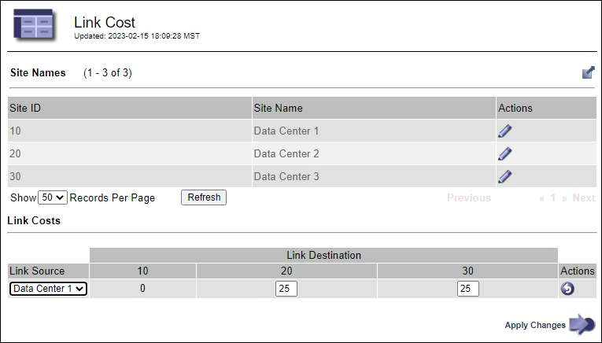

= リンクコストを管理します
:allow-uri-read: 
:icons: font
:imagesdir: ../media/

[role="lead"]
リンクコストを使用すると、複数のデータセンターサイトが存在する場合に、要求されたサービスを提供するデータセンターサイトの優先順位を決定できます。サイト間のレイテンシに合わせてリンクコストを調整できます。

== リンクコストとは

* リンクコストは、オブジェクトの読み出しにどのオブジェクトコピーを使用するかを優先的に処理するために使用されます。
* リンクコストは、グリッド管理 API およびテナント管理 API で、使用する内部 StorageGRID サービスを決定するために使用されます。
* リンクコストは、管理ノードおよびゲートウェイノード上のロードバランササービスでクライアント接続を転送するために使用されます。を参照して link:../admin/managing-load-balancing.html["ロードバランシングに関する考慮事項"]

次の図は、サイト間でリンクコストが設定されている 3 つのサイトグリッドを示しています。

image::../media/link_costs.gif[データセンター間のリンクコストの概念図]

* 管理ノードとゲートウェイノード上のロードバランササービスは、同じデータセンターサイトにあるすべてのストレージノード、およびリンクコストが0のデータセンターサイトにクライアント接続を均等に分散します。
+
この例で、データセンターサイト 1 （ DC1 ）にあるゲートウェイノードは、 DC1 にあるストレージノードと DC2 にあるストレージノードにクライアント接続を均等に分散します。DC3 にあるゲートウェイノードは、 DC3 にあるストレージノードにのみクライアント接続を送信します。

* 複数のレプリケートコピーが存在するオブジェクトを読み出す場合、 StorageGRID はリンクコストが最も低いデータセンターにあるコピーを読み出します。
+
次の例では、DC2にあるクライアントアプリケーションがDC1とDC3の両方に格納されているオブジェクトを読み出す場合、DC1からDC2へのリンクコストは0であり、DC3からDC2へのリンクコスト（25）よりも低いため、オブジェクトはDC1から読み出されます。

リンクコストは、測定単位を伴わない任意の相対的な数値です。たとえば、使用にあたってリンクコスト 50 の優先度はリンクコスト 25 よりも低くなります。次の表に、よく使用されるリンクコストを示します。

[cols="1a,1a,2a"]
|===
| リンク | リンクコスト | 脚注 

 a| 
物理データセンターサイト間
 a| 
25（デフォルト）
 a| 
WAN リンクで接続されたデータセンター。

 a| 
同じ物理的な場所にある論理データセンターサイト間
 a| 
0
 a| 
同じ物理ビルディングまたはキャンパスにある論理データセンターを LAN で接続します。

|===

== リンクコストを更新します

データセンターサイト間のリンクコストを更新して、サイト間のレイテンシを反映させることができます。

.開始する前に
* Grid Managerにサインインしておきますlink:../admin/web-browser-requirements.html["サポートされている Web ブラウザ"]。
* あなたはを持っていますlink:admin-group-permissions.html["Gridトポロジページの設定権限"]。

.手順
. * support *>* other *>* Link cost *を選択します。
+

. [ リンク先 * ] でサイトを選択し、 [ リンク先 * ] に 0 ～ 100 のコスト値を入力します。
+
送信元が宛先と同じ場合は、リンクコストを変更できません。

+
変更をキャンセルするにはimage:../media/nms_revert.gif["取り消しアイコン"]、*[元に戻す]*を選択します。

. 「 * 変更を適用する * 」を選択します。

