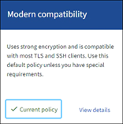

= TLSおよびSSHポリシーを管理します
:allow-uri-read: 
:icons: font
:imagesdir: ../media/

[role="lead"]
TLSおよびSSHポリシーは、クライアントアプリケーションとのセキュアなTLS接続の確立および内部StorageGRID サービスへのセキュアなSSH接続に使用されるプロトコルと暗号を決定します。

セキュリティポリシーは、TLSとSSHによる移動中のデータの暗号化方法を制御します。一般に、お使いのシステムがCCに準拠している必要がある場合、または他の暗号を使用する必要がある場合を除き、最新の互換性（デフォルト）ポリシーを使用してください。

NOTE: 一部のStorageGRID サービスは、これらのポリシーで暗号を使用するように更新されていません。

.開始する前に
* Grid Managerにサインインしておきますlink:../admin/web-browser-requirements.html["サポートされている Web ブラウザ"]。
* あなたはを持っていますlink:admin-group-permissions.html["rootアクセス権限"]。

== セキュリティポリシーを選択します

.手順
. *構成* > *セキュリティ* > *セキュリティ設定*を選択します。
+
TLSおよびSSHポリシー*タブには、使用可能なポリシーが表示されます。ポリシーのタイルには、現在アクティブなポリシーが緑のチェックマークで表示されます。

+

. 利用可能なポリシーの詳細については、タブを確認してください。
+
[role="tabbed-block"]
====
.最新の互換性（デフォルト）
--
強力な暗号化が必要で、特別な要件がない場合は、デフォルトのポリシーを使用します。このポリシーは、ほとんどの TLS および SSH クライアントと互換性があります。

--
.レガシー互換性
--
古いクライアントに追加の互換性オプションが必要な場合は、レガシー互換性ポリシーを使用します。このポリシーの追加オプションにより、モダン互換性ポリシーよりも安全性が低くなる可能性があります。

--
.Common Criteriaの略
--
Common Criteria 認証が必要な場合は、Common Criteria ポリシーを使用します。

--
.FIPS strict
--
Common Criteria 認定が必要であり、ロード バランサ エンドポイント、Tenant Manager、および Grid Manager への外部クライアント接続にNetApp Cryptographic Security Module (NCSM) 3.0.8 またはNetApp StorageGRID Kernel Crypto API 6.1.129-1-ntap1-amd64 モジュールを使用する必要がある場合は、FIPS 厳密ポリシーを使用します。このポリシーを使用するとパフォーマンスが低下する可能性があります。

NCSM 3.0.8 およびNetApp StorageGRID Kernel Crypto API 6.1.129-1-ntap1-amd64 モジュールは、次の操作で使用されます。

** NCSM
+
*** 次のサービス間の TLS 接続: ADC、AMS、CMN、DDS、LDR、SSM、NMS、mgmt-api、nginx、nginx-gw、cache-svc
*** クライアントと nginx-gw サービス (ロードバランサのエンドポイント) 間の TLS 接続
*** クライアントとLDRサービス間のTLS接続
*** SSE-S3、SSE-C、および保存されたオブジェクトの暗号化設定のオブジェクトコンテンツの暗号化
*** SSH 接続

+
詳細については、NIST暗号アルゴリズム検証プログラムを参照してください。link:https://csrc.nist.gov/projects/cryptographic-module-validation-program/certificate/4838["証明書番号4838"^] 。

** NetApp StorageGRIDカーネル暗号 API モジュール
+
NetApp StorageGRIDカーネル暗号化 API モジュールは、VM およびStorageGRIDアプライアンス プラットフォームにのみ存在します。

+
*** エントロピー収集
*** ノード暗号化

+
詳細については、NIST暗号アルゴリズム検証プログラムを参照してください。link:https://csrc.nist.gov/projects/cryptographic-algorithm-validation-program/validation-search?searchMode=implementation&product=NetApp+StorageGRID+Kernel+Crypto+API&productType=-1&ipp=50["証明書 #A6242 から #A6257"^]そしてlink:https://csrc.nist.gov/projects/cryptographic-module-validation-program/entropy-validations/certificate/223["エントロピー証明書 #E223"^]。

*注意*: このポリシーを選択すると、link:../maintain/rolling-reboot-procedure.html["ローリングリブートを実行する"]すべてのノードでNCSMをアクティブ化します。再起動を開始および監視するには、[メンテナンス] > [ローリング再起動] を使用します。

--
.カスタム
--
独自の暗号を適用する必要がある場合は、カスタムポリシーを作成します。

オプションとして、 StorageGRIDに FIPS 140 暗号化要件がある場合は、FIPS モード機能を有効にして、NCSM 3.0.8 およびNetApp StorageGRID Kernel Crypto API 6.1.129-1-ntap1-amd64 モジュールを使用します。

.. 設定する `fipsMode`パラメータに `true`。
.. プロンプトが表示されたら、link:../maintain/rolling-reboot-procedure.html["ローリングリブートを実行する"]すべてのノードで暗号化モジュールをアクティブ化します。再起動を開始および監視するには、[メンテナンス] > [ローリング再起動] を使用します。
.. アクティブな FIPS モジュール バージョンを表示するには、[サポート] > [診断] を選択します。

--
====
. 各ポリシーの暗号、プロトコル、およびアルゴリズムの詳細を表示するには、*[詳細を表示]*を選択します。
. 現在のポリシーを変更するには、*[ポリシーを使用]*を選択します。
+
ポリシータイルの*現在のポリシー*の横に緑のチェックマークが表示されます。

== カスタムセキュリティポリシーを作成します

独自の暗号を適用する必要がある場合は、カスタムポリシーを作成できます。

.手順
. 作成するカスタムポリシーに最も近いポリシーのタイルで、*[詳細を表示]*を選択します。
. [クリップボードにコピー]*を選択し、*[キャンセル]*を選択します。
+
image::../media/securitysettings-custom-security-policy-copy.png[既存のポリシーをコピーしてカスタムポリシーを作成する]

. [カスタムポリシー]タイルで、*[設定と使用]*を選択します。
. コピーしたJSONを貼り付けて、必要な変更を行います。
. [ポリシーを使用]*を選択します。
+
[カスタムポリシー]タイルの*[現在のポリシー]*の横に緑のチェックマークが表示されます。

. 必要に応じて、*[設定の編集]*を選択して、新しいカスタムポリシーをさらに変更します。

== 一時的にデフォルトのセキュリティポリシーに戻します

カスタムセキュリティポリシーを設定した場合、設定したTLSポリシーがと互換性がないと、Grid Managerにサインインできないことがありますlink:global-certificate-types.html["サーバ証明書を設定しました"]。

一時的にデフォルトのセキュリティポリシーに戻すことができます。

.手順
. 管理ノードにログインします。
+
.. 次のコマンドを入力します。 `ssh admin@_Admin_Node_IP_`
.. ファイルに記載されているパスワードを入力し `Passwords.txt`ます。
.. 次のコマンドを入力してrootに切り替えます。 `su -`
.. ファイルに記載されているパスワードを入力し `Passwords.txt`ます。
+
rootとしてログインすると、プロンプトがからに `#`変わります `$`。

. 次のコマンドを実行します。
+
`restore-default-cipher-configurations`

. Web ブラウザから、同じ管理ノード上の Grid Manager にアクセスする。
. ポリシーを再度設定するには、の手順に従い<<select-a-security-policy,セキュリティポリシーを選択します>>ます。

