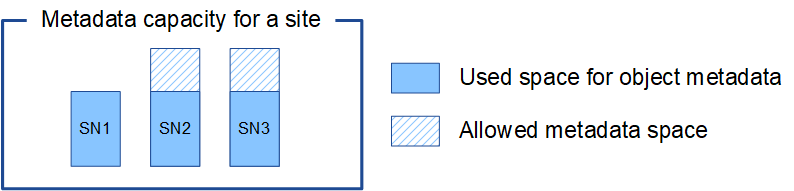

= オブジェクトメタデータストレージを管理する
:allow-uri-read: 
:icons: font
:imagesdir: ../media/

[role="lead"]
StorageGRID システムのオブジェクトメタデータ容量は、そのシステムに格納できるオブジェクトの最大数を制御します。StorageGRID システムに新しいオブジェクトを格納するための十分なスペースを確保するには、 StorageGRID がオブジェクトメタデータを格納する場所と方法を理解する必要があります。

== オブジェクトメタデータとは

オブジェクトメタデータは、オブジェクトについて記述された任意の情報です。StorageGRID では、オブジェクトメタデータを使用してグリッド全体のすべてのオブジェクトの場所を追跡し、各オブジェクトのライフサイクルを継続的に管理します。

StorageGRID のオブジェクトの場合、オブジェクトメタデータには次の種類の情報が含まれます。

* システムメタデータ（各オブジェクト（UUID）の一意のID、オブジェクト名、S3バケットの名前、テナントアカウントの名前またはID、オブジェクトの論理サイズ、オブジェクトの作成日時、オブジェクトの最終変更日時など）。
* オブジェクトに関連付けられているカスタムユーザメタデータのキーと値のペア。
* S3 オブジェクトの場合、オブジェクトに関連付けられているオブジェクトタグのキーと値のペア。
* レプリケートオブジェクトコピーの場合、各コピーの現在の格納場所。
* イレイジャーコーディングオブジェクトコピーの場合、各フラグメントの現在の格納場所。
* クラウドストレージプール内のオブジェクトコピーの場合、外部バケットの名前とオブジェクトの一意の識別子を含むオブジェクトの場所。
* セグメント化されたオブジェクトやマルチパートオブジェクトの場合、セグメント ID とデータサイズ。

== オブジェクトメタデータの格納方法

StorageGRID は Cassandra データベースにオブジェクトメタデータを保持し、 Cassandra データベースはオブジェクトデータとは別に格納されます。冗長性を確保し、オブジェクトメタデータを損失から保護するために、 StorageGRID は各サイトのシステム内のすべてのオブジェクトにメタデータのコピーを 3 つずつ格納します。

この図は、 2 つのサイトのストレージノードを表しています。各サイトには同じ量のオブジェクトメタデータが格納され、各サイトのメタデータがそのサイトのすべてのストレージノードに分割されます。

image::../media/metadata_space_across_sites.png[サイト間のメタデータスペース]

== オブジェクトメタデータの格納先

この図は、単一のストレージノードのストレージボリュームを表しています。

image::../media/metadata_space_storage_node.png[Metadata Space ストレージノード]

図に示すように、 StorageGRID は各ストレージノードのストレージボリューム 0 にオブジェクトメタデータ用のスペースをリザーブします。リザーブスペースを使用してオブジェクトメタデータを格納し、重要なデータベース処理を実行します。ストレージボリューム 0 の残りのスペースとストレージノード内のその他すべてのストレージボリュームは、オブジェクトデータ（レプリケートコピーとイレイジャーコーディングフラグメント）専用に使用されます。

特定のストレージノードでオブジェクトメタデータ用にリザーブされるスペースの量は、いくつかの要因によって異なります。以下にその例を示します。

== メタデータリザーブスペースの設定

Metadata reserved space _は、各ストレージノードのボリューム0でメタデータ用にリザーブされるスペースの量を示すシステム全体の設定です。次の表に示すように、この設定のデフォルト値は次の基準に基づいています。

* StorageGRID の最初のインストール時に使用していたソフトウェアバージョン。
* 各ストレージノード上の RAM の容量。

[cols="1a,1a,1a"]
|===
| StorageGRID の初期インストールに使用するバージョン | ストレージノード上の RAM の容量 | Metadata Reserved Spaceのデフォルト設定 

 a| 
11.5～11.9
 a| 
グリッド内の各ストレージノードで 128GB 以上
 a| 
8 TB （ 8 、 000 GB ）

 a| 
 a| 
グリッド内の任意のストレージノードで 128GB 未満
 a| 
3TB （ 3 、 000GB ）

 a| 
11.1～11.4
 a| 
いずれかのサイトの各ストレージノードで 128GB 以上
 a| 
4TB （ 4 、 000GB ）

 a| 
 a| 
各サイトのストレージノードで 128GB 未満
 a| 
3TB （ 3 、 000GB ）

 a| 
11.0以前
 a| 
任意の金額
 a| 
2TB （ 2 、 000 GB ）

|===

=== メタデータリザーブスペースの設定を表示

StorageGRIDシステムのMetadata Reserved Space設定を表示するには、次の手順を実行します。

.手順
. [設定]*>*[システム]*>*[ストレージ設定]*を選択します。
. [ストレージ設定]ページで、*[メタデータリザーブスペース]*セクションを展開します。

StorageGRID 11.8以降では、Metadata Reserved Spaceの値が100GB以上1PB以下である必要があります。

各ストレージノードに128GB以上のRAMが搭載されているStorageGRID 11.6以降の新規インストールのデフォルト設定は8、000GB（8TB）です。

== メタデータ用にリザーブされている実際のスペース

システム全体のMetadata Reserved Space設定とは異なり、オブジェクトメタデータ用の_actual reserved space_forはストレージノードごとに決定されます。あるストレージノードについて、メタデータ用に実際にリザーブされるスペースは、そのノードのボリューム0のサイズ、およびシステム全体でのMetadata Reserved Spaceの設定によって異なります。

[cols="1a,1a"]
|===
| ノードのボリューム 0 のサイズ | メタデータ用にリザーブされている実際のスペース 

 a| 
500 GB未満（非本番環境での使用）
 a| 
ボリューム 0 の 10%

 a| 
500GB以上のメタデータ専用ストレージノード
 a| 
次の値のうち小さい方：

* ボリューム0
* メタデータリザーブスペースの設定

*注*：メタデータのみのストレージノードに必要なrangedbは1つだけです。

|===

=== メタデータ用に実際にリザーブされているスペースを表示する

特定のストレージノードでメタデータ用に実際にリザーブされているスペースを表示する手順は、次のとおりです。

.手順
. Grid Manager から * nodes * > * _ Storage Node_* を選択します。
. [ * ストレージ * ] タブを選択します。
. [Storage Used - Object Metadata]グラフにカーソルを合わせ、* Actual Reserved *の値を確認します。
+
image::../media/storage_used_object_metadata_actual_reserved.png[使用済みストレージ - オブジェクトメタデータ - リザーブ容量]

スクリーンショットでは、実際の予約数 * の値は 8TB です。このスクリーンショットは、StorageGRID 11.6を新規にインストールした大規模ストレージノードを示しています。システム全体のMetadata Reserved Space設定はこのストレージノードのボリューム0よりも小さいため、このノードの実際にリザーブされるスペースはMetadata Reserved Space設定と同じになります。

== 実際にリザーブされているメタデータスペースの例

バージョン11.7以降を使用して新しいStorageGRIDシステムをインストールしたとします。この例では、各ストレージノードの RAM が 128GB を超え、ストレージノード 1 （ SN1 ）のボリューム 0 が 6TB であるとします。次の値に基づきます。

* システム全体の* Metadata Reserved Space *が8TBに設定されています。（各ストレージノードのRAMが128GBを超える場合、新しいStorageGRID 11.6以降のインストールのデフォルト値です）。
* SN1 のメタデータ用にリザーブされている実際のスペースは 6TB です。（ボリューム0が* Metadata Reserved Space *設定より小さいため、ボリューム全体がリザーブされます）。

== 許可されているメタデータスペースです

メタデータ用に実際に予約されている各ストレージノードは、オブジェクトメタデータに使用できるスペース（許容されるメタデータスペース _ ）と、重要なデータベース処理（コンパクションや修復など）や将来のハードウェアおよびソフトウェアのアップグレードに必要なスペースに分割されます。許可されるメタデータスペースは、オブジェクトの全体的な容量を決定します。

image::../media/metadata_allowed_space_volume_0.png[Metadata Allowed Space ：ボリューム 0]

次の表に、各ストレージノードのメモリ容量とメタデータ用に実際にリザーブされているスペースに基づいてStorageGRID で許容されるメタデータスペース*がどのように計算されるかを示します。

[cols="1a,1a,2a,2a"]
|===

 a| 
 a| 
 a| 
*ストレージノード上のメモリ容量*

 a| 
 a| 
 a| 
<128 GB
 a| 
>=128 GB

 a| 
*メタデータ用に実際にリザーブされているスペース*
 a| 
<=4 TB
 a| 
メタデータ用にリザーブされている実際のスペースの 60% 。最大 1.32 TB
 a| 
メタデータ用にリザーブされている実際のスペースの 60% 。最大 1.98 TB

 a| 
&GT；4 TB
 a| 
（メタデータ用に実際にリザーブされるスペース−1TB）×60%、最大1.32 TB
 a| 
（メタデータ用に実際にリザーブされるスペース−1TB）×60%、最大3.96 TB

|===

=== 許可されているメタデータスペースを表示する

ストレージノードで許可されているメタデータスペースを表示するには、次の手順を実行します。

.手順
. Grid Manager から * nodes * を選択します。
. ストレージノードを選択します。
. [ * ストレージ * ] タブを選択します。
. [Storage Used - object metadata]グラフにカーソルを合わせ、* allowed *の値を確認します。
+
image::../media/storage_used_object_metadata_allowed.png[使用済みストレージ - オブジェクトメタデータを許可]

スクリーンショットでは、「許可」の値は3.96TBです。これは、メタデータ用に実際にリザーブされているスペースが4TBを超えるストレージノードの最大値です。

「 * Allowed * 」の値は、次の Prometheus 指標に対応します。

`storagegrid_storage_utilization_metadata_allowed_bytes`

== 許可されるメタデータスペースの例

バージョン11.6を使用してStorageGRID システムをインストールするとします。この例では、各ストレージノードの RAM が 128GB を超え、ストレージノード 1 （ SN1 ）のボリューム 0 が 6TB であるとします。次の値に基づきます。

* システム全体の* Metadata Reserved Space *が8TBに設定されています。（各ストレージノードのRAMが128GBを超える場合のStorageGRID 11.6以降のデフォルト値です）。
* SN1 のメタデータ用にリザーブされている実際のスペースは 6TB です。（ボリューム0が* Metadata Reserved Space *設定より小さいため、ボリューム全体がリザーブされます）。
* SN1のメタデータ用に許容されるスペースは3 TBで、<<table-allowed-space-for-metadata,メタデータに使用できるスペースの表>>（メタデータ用に実際に予約されているスペース−1 TB）×60%、最大3.96 TBに示されている計算に基づいています。

== サイズの異なるストレージノードがオブジェクト容量に与える影響

前述したように、 StorageGRID は各サイトのストレージノードにオブジェクトメタデータを均等に分散します。このため、サイトにサイズが異なるストレージノードがある場合、サイトで一番小さいノードがサイトのメタデータ容量を決定します。

次の例を考えてみましょう。

* サイズの異なる 3 つのストレージノードを含む単一サイトのグリッドがある。
* Metadata Reserved Space *設定は4TBです。
* ストレージノードには、リザーブされている実際のメタデータスペースと許可されているメタデータスペースについて、次の値があります。
+
[cols="1a,1a,1a,1a"]
|===
| ストレージノード | ボリューム 0 のサイズ | リザーブされている実際のメタデータスペースです | 許可されているメタデータスペースです 

 a| 
SN1
 a| 
2.2TB
 a| 
2.2TB
 a| 
1.32TB

 a| 
SN2
 a| 
5TB
 a| 
4TB
 a| 
1.98TB

 a| 
SN3
 a| 
6TB
 a| 
4TB
 a| 
1.98TB

|===

オブジェクトメタデータはサイトのストレージノード間で均等に分散されるため、この例の各ノードが格納できるメタデータは 1.32TB です。SN2およびSN3で使用できる追加の0.66TBのメタデータスペースは使用できません。

同様に、 StorageGRID は各サイトで StorageGRID システムのすべてのオブジェクトメタデータを管理するため、 StorageGRID システム全体のメタデータ容量は最小サイトのオブジェクトメタデータ容量で決まります。

また、オブジェクトメタデータの容量はオブジェクトの最大数に制御されるため、一方のノードがメタデータの容量を超えると、実質的にグリッドがフルになります。

.関連情報
* 各ストレージノードのオブジェクトメタデータ容量を監視する方法については、の手順を参照してくださいlink:../monitor/index.html["StorageGRID の監視"]。
* システムのオブジェクトメタデータ容量を増やすには、link:../expand/index.html["グリッドを展開する"]新しいストレージノードを追加します。

