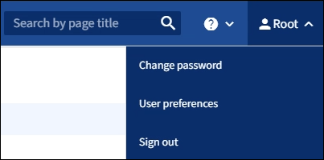

= Grid Manager からサインアウトします
:allow-uri-read: 
:icons: font
:imagesdir: ../media/

[role="lead"]
グリッドマネージャの操作が完了したら、サインアウトして、権限のないユーザがStorageGRID システムにアクセスできないようにする必要があります。ブラウザのクッキーの設定によっては、ブラウザを閉じてもシステムからサインアウトされない場合があります。

.手順
. 右上のユーザ名を選択します。
+
リンク]

. [サインアウト]*を選択します。
+
[cols="1a,2a"]
|===
| オプション | 製品説明 

 a| 
SSO は使用されていません
 a| 
管理ノードからサインアウトされます。

Grid Manager のサインインページが表示されます。

* 注： * 複数の管理ノードにサインインした場合、各ノードからサインアウトする必要があります。

 a| 
SSOが有効
 a| 
アクセスしていたすべての管理ノードからサインアウトされます。StorageGRID のサインインページが表示されます。*Grid Manager* は、 [Recent Accounts] * ドロップダウンにデフォルトとして表示され、 [*Account ID*] フィールドには 0 と表示されます。

*注意:* SSOが有効になっていて、テナントマネージャにもサインインしている場合は、link:../tenant/signing-out-of-tenant-manager.html["テナントアカウントからサインアウトします"]にlink:how-sso-works.html["SSOからサインアウトします"]。

|===

