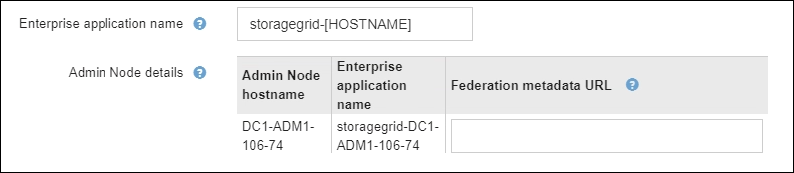

= サンドボックスモードを使用する
:allow-uri-read: 
:icons: font
:imagesdir: ../media/

[role="lead"]
サンドボックスモードを使用すると、すべての StorageGRID ユーザに対してシングルサインオン（ SSO ）を有効にする前に、シングルサインオン（ SSO ）を設定およびテストできます。SSO を有効にした後は、設定を変更したり再テストしたりする必要がある場合に、サンドボックスモードに戻ることができます。

.開始する前に
* Grid Managerにサインインしておきますlink:../admin/web-browser-requirements.html["サポートされている Web ブラウザ"]。
* あなたはを持っていますlink:admin-group-permissions.html["rootアクセス権限"]。
* StorageGRID システムにアイデンティティフェデレーションを設定しておきます。
* アイデンティティフェデレーション * LDAP サービスタイプ * では、使用する SSO アイデンティティプロバイダに基づいて、 Active Directory または Azure のいずれかを選択しました。
+
[cols="1a,1a"]
|===
| LDAP サービスタイプが設定されました | SSO アイデンティティプロバイダのオプション 

 a| 
Active Directory
 a| 
** Active Directory
** Azure
** PingFederate

 a| 
Azure
 a| 
Azure

|===

.タスクの内容
SSO が有効な場合、ユーザが管理ノードにサインインしようとすると、 StorageGRID から SSO アイデンティティプロバイダに認証要求が送信されます。次に、 SSO アイデンティティプロバイダは、認証要求が成功したかどうかを示す認証応答を StorageGRID に返します。成功した要求の場合：

* Active Directory または PingFederate からの応答には、ユーザの Universally Unique Identifier （ UUID ）が含まれています。
* Azure からの応答には、ユーザプリンシパル名（ UPN ）が含まれます。

StorageGRID （サービスプロバイダ）と SSO アイデンティティプロバイダがユーザ認証要求についてセキュアに通信できるようにするには、 StorageGRID で特定の設定を行う必要があります。次に、 SSO アイデンティティプロバイダのソフトウェアを使用して、管理ノードごとに証明書利用者信頼（ AD FS ）、エンタープライズアプリケーション（ Azure ）、またはサービスプロバイダ（ PingFederate ）を作成する必要があります。最後に、 StorageGRID に戻って SSO を有効にする必要があります。

サンドボックスモードでは、 SSO を有効にする前に、この手順を簡単に実行し、すべての設定をテストできます。サンドボックスモードを使用している場合、ユーザはSSOを使用してサインインできません。

== サンドボックスモードにアクセスします

.手順
. [ * 設定 * > * アクセス制御 * > * シングルサインオン * ] を選択します。
+
[Single Sign-On] ページが表示され、 [*Disabled*] オプションが選択されます。

+
image::../media/sso_status_disabled.png[SSO ステータスが無効になっているシングルサインオンページ]

+

NOTE: [SSO Status]オプションが表示されない場合は、アイデンティティプロバイダをフェデレーテッドアイデンティティソースとして設定していることを確認します。を参照して link:requirements-for-sso.html["シングルサインオンの要件と考慮事項"]

. [ * サンドボックスモード * ] を選択します。
+
[Identity Provider] セクションが表示されます。

== アイデンティティプロバイダの詳細を入力します

.手順
. ドロップダウンリストから * SSO タイプ * を選択します。
. 選択した SSO タイプに基づいて、 [Identity Provider] セクションのフィールドに入力します。
+
[role="tabbed-block"]
====
.Active Directory
--
.. アイデンティティプロバイダの * フェデレーションサービス名 * を、 Active Directory フェデレーションサービス（ AD FS ）に表示されているとおりに入力します。
+

NOTE: フェデレーションサービス名を確認するには、 Windows Server Manager に移動します。[ ツール *>*AD FS 管理 *] を選択します。[ アクション ] メニューから、 [ * フェデレーションサービスのプロパティの編集 * ] を選択します。フェデレーションサービス名が 2 番目のフィールドに表示されます。

.. StorageGRID 要求への応答としてアイデンティティプロバイダが SSO 設定情報を送信するときに、接続の保護に使用する TLS 証明書を指定します。
+
*** * オペレーティング・システムの CA 証明書を使用 * ：オペレーティング・システムにインストールされているデフォルトの CA 証明書を使用して、接続を保護します。
*** * カスタム CA 証明書を使用 * ：カスタム CA 証明書を使用して接続を保護します。
+
この設定を選択した場合は、カスタム証明書のテキストをコピーし、 * CA 証明書 * テキストボックスに貼り付けます。

*** * Do not use TLS* ： TLS 証明書を使用して接続を保護しないでください。
+

CAUTION: CA証明書を変更した場合は、すぐにlink:../maintain/starting-or-restarting-service.html["管理ノードでmgmt-apiサービスを再起動します。"]Grid ManagerでSSOが成功するかどうかをテストします。

.. 証明書利用者セクションで、 StorageGRID の * 証明書利用者 ID * を指定します。この値は、 AD FS の各証明書利用者信頼に使用する名前を制御します。
+
*** たとえば、グリッドに管理ノードが1つしかなく、今後管理ノードを追加する予定がない場合は、または `StorageGRID`と入力し `SG`ます。
*** グリッドに複数の管理ノードが含まれている場合は、識別子に文字列を含め `[HOSTNAME]`ます。たとえば、 `SG-[HOSTNAME]`です。これにより、ノードのホスト名に基づいて、システム内の管理ノードごとの証明書利用者 ID を示すテーブルが生成されます。
+
image::../media/sso_status_sandbox_mode_active_directory.png[シングルサインオン,Sandbox mode enabled,Relying party identifiers shown for several Admin Nodes]

+

NOTE: 証明書利用者信頼は StorageGRID システム内の管理ノードごとに作成する必要があります。管理ノードごとに証明書利用者信頼を作成することで、ユーザは管理ノードに対して安全にサインイン / サインアウトすることができます。

.. [ 保存（ Save ） ] を選択します。
+
数秒間、 * Save * （保存）ボタンに緑色のチェックマークが表示されます。

+
image::../media/save_button_green_checkmark.gif[緑色のチェックマークが付いた[Save]ボタン]

--
.Azure
--
.. StorageGRID 要求への応答としてアイデンティティプロバイダが SSO 設定情報を送信するときに、接続の保護に使用する TLS 証明書を指定します。
+
*** * オペレーティング・システムの CA 証明書を使用 * ：オペレーティング・システムにインストールされているデフォルトの CA 証明書を使用して、接続を保護します。
*** * カスタム CA 証明書を使用 * ：カスタム CA 証明書を使用して接続を保護します。
+
この設定を選択した場合は、カスタム証明書のテキストをコピーし、 * CA 証明書 * テキストボックスに貼り付けます。

*** * Do not use TLS* ： TLS 証明書を使用して接続を保護しないでください。
+

CAUTION: CA証明書を変更した場合は、すぐにlink:../maintain/starting-or-restarting-service.html["管理ノードでmgmt-apiサービスを再起動します。"]Grid ManagerでSSOが成功するかどうかをテストします。

.. [ エンタープライズアプリケーション ] セクションで、 StorageGRID のエンタープライズアプリケーション名 * を指定します。この値は、 Azure AD の各エンタープライズアプリケーションに使用する名前を制御します。
+
*** たとえば、グリッドに管理ノードが1つしかなく、今後管理ノードを追加する予定がない場合は、または `StorageGRID`と入力し `SG`ます。
*** グリッドに複数の管理ノードが含まれている場合は、識別子に文字列を含め `[HOSTNAME]`ます。たとえば、 `SG-[HOSTNAME]`です。これにより、システム内の管理ノードごとに、そのノードのホスト名に基づいてエンタープライズアプリケーション名が表形式で表示されます。
+

+

NOTE: StorageGRID システムで管理ノードごとにエンタープライズアプリケーションを作成する必要があります。管理ノードごとにエンタープライズアプリケーションを用意することで、ユーザはどの管理ノードに対しても安全にサインイン / サインアウトすることができます。

.. 表に記載されている管理ノードごとにエンタープライズアプリケーションを作成するには、の手順に従いlink:../admin/creating-enterprise-application-azure.html["Azure AD でエンタープライズアプリケーションを作成"]ます。
.. Azure AD から、各エンタープライズアプリケーションのフェデレーションメタデータの URL をコピーします。次に、この URL を StorageGRID の対応する * フェデレーションメタデータ URL* フィールドに貼り付けます。
.. すべての管理ノードのフェデレーションメタデータの URL をコピーして貼り付けたら、「 * 保存 * 」を選択します。
+
数秒間、 * Save * （保存）ボタンに緑色のチェックマークが表示されます。

+
image::../media/save_button_green_checkmark.gif[緑色のチェックマークが付いた[Save]ボタン]

--
.PingFederate
--
.. StorageGRID 要求への応答としてアイデンティティプロバイダが SSO 設定情報を送信するときに、接続の保護に使用する TLS 証明書を指定します。
+
*** * オペレーティング・システムの CA 証明書を使用 * ：オペレーティング・システムにインストールされているデフォルトの CA 証明書を使用して、接続を保護します。
*** * カスタム CA 証明書を使用 * ：カスタム CA 証明書を使用して接続を保護します。
+
この設定を選択した場合は、カスタム証明書のテキストをコピーし、 * CA 証明書 * テキストボックスに貼り付けます。

*** * Do not use TLS* ： TLS 証明書を使用して接続を保護しないでください。
+

CAUTION: CA証明書を変更した場合は、すぐにlink:../maintain/starting-or-restarting-service.html["管理ノードでmgmt-apiサービスを再起動します。"]Grid ManagerでSSOが成功するかどうかをテストします。

.. Service Provider （ SP ；サービスプロバイダ）セクションで、 StorageGRID の * SP 接続 ID * を指定します。この値は、 PingFederate の各 SP 接続に使用する名前を制御します。
+
*** たとえば、グリッドに管理ノードが1つしかなく、今後管理ノードを追加する予定がない場合は、または `StorageGRID`と入力し `SG`ます。
*** グリッドに複数の管理ノードが含まれている場合は、識別子に文字列を含め `[HOSTNAME]`ます。たとえば、 `SG-[HOSTNAME]`です。これにより、システム内の管理ノードごとに、そのノードのホスト名に基づいて SP 接続 ID を示す表が生成されます。
+
image::../media/sso_status_sandbox_mode_ping_federated.png[シングルサインオン,Sandbox mode enabled,Relying party identifiers shown for several Admin Nodes]

+

NOTE: StorageGRID システムで管理ノードごとに SP 接続を作成する必要があります。管理ノードごとに SP 接続を確立することで、ユーザは管理ノードに対して安全にサインイン / サインアウトすることができます。

.. 各管理ノードのフェデレーションメタデータの URL を * Federation metadata url * フィールドで指定します。
+
次の形式を使用します。

+
[listing]
----
https://<Federation Service Name>:<port>/pf/federation_metadata.ping?PartnerSpId=<SP Connection ID>
----
.. [ 保存（ Save ） ] を選択します。
+
数秒間、 * Save * （保存）ボタンに緑色のチェックマークが表示されます。

+
image::../media/save_button_green_checkmark.gif[緑色のチェックマークが付いた[Save]ボタン]

--
====

== 証明書利用者信頼、エンタープライズアプリケーション、または SP 接続を設定する

設定を保存すると、サンドボックスモードの確認メッセージが表示されます。サンドボックスモードが有効になったことを確認し、概要を示します。

StorageGRID は、必要に応じてサンドボックスモードのままにすることができます。ただし、シングルサインオンページで * サンドボックスモード * を選択すると、すべての StorageGRID ユーザーに対して SSO が無効になります。サインインできるのはローカルユーザのみです。

証明書利用者信頼（ Active Directory ）、完全なエンタープライズアプリケーション（ Azure ）、または SP 接続（ PingFederate ）を設定するには、次の手順を実行します。

[role="tabbed-block"]
====
.Active Directory
--
.手順
. Active Directory フェデレーションサービス（ AD FS ）に移動します。
. StorageGRID のシングルサインオンページの表に示す各証明書利用者 ID を使用して、 StorageGRID 用の証明書利用者信頼を 1 つ以上作成します。
+
次の表に示す管理ノードごとに信頼を 1 つ作成する必要があります。

+
手順については、を参照してくださいlink:../admin/creating-relying-party-trusts-in-ad-fs.html["AD FS に証明書利用者信頼を作成します"]。

--
.Azure
--
.手順
. 現在サインインしている管理ノードのシングルサインオンページから、 SAML メタデータをダウンロードして保存するボタンを選択します。
. グリッド内の他の管理ノードについて、上記の手順を繰り返します。
+
.. ノードにサインインします。
.. [ * 設定 * > * アクセス制御 * > * シングルサインオン * ] を選択します。
.. そのノードの SAML メタデータをダウンロードして保存します。

. Azure ポータルにアクセスします。
. の手順に従ってlink:../admin/creating-enterprise-application-azure.html["Azure AD でエンタープライズアプリケーションを作成"]、各管理ノードのSAMLメタデータファイルを対応するAzureエンタープライズアプリケーションにアップロードします。

--
.PingFederate
--
.手順
. 現在サインインしている管理ノードのシングルサインオンページから、 SAML メタデータをダウンロードして保存するボタンを選択します。
. グリッド内の他の管理ノードについて、上記の手順を繰り返します。
+
.. ノードにサインインします。
.. [ * 設定 * > * アクセス制御 * > * シングルサインオン * ] を選択します。
.. そのノードの SAML メタデータをダウンロードして保存します。

. 「 PingFederate 」に移動します。
. link:../admin/creating-sp-connection-ping.html["StorageGRID 用に 1 つ以上の SP 接続を作成します"]です。各管理ノードの SP 接続 ID （ StorageGRID の Single Sign-On ページの表を参照）と、その管理ノード用にダウンロードした SAML メタデータを使用します。
+
次の表に示す管理ノードごとに 1 つの SP 接続を作成する必要があります。

--
====

== SSO 接続をテストします

StorageGRID システム全体にシングルサインオンを適用する前に、各管理ノードでシングルサインオンとシングルログアウトが正しく設定されていることを確認する必要があります。

[role="tabbed-block"]
====
.Active Directory
--
.手順
. StorageGRID のシングルサインオンページで、サンドボックスモードメッセージ内のリンクを探します。
+
URL は、 [ * フェデレーションサービス名 * （ * Federation service name * ） ] フィールドに入力した値から取得されます。

+
image::../media/sso_sandbox_mode_url.gif[アイデンティティプロバイダのサインオンページの URL]

. リンクを選択するか、 URL をコピーしてブラウザに貼り付け、アイデンティティプロバイダのサインオンページにアクセスします。
. SSO を使用して StorageGRID にサインインできることを確認するには、 * 次のいずれかのサイトにサインイン * を選択し、プライマリ管理ノードの証明書利用者 ID を選択して * サインイン * を選択します。
+
image::../media/sso_sandbox_mode_testing.gif[SSO サンドボックスモードで証明書利用者信頼をテストします]

. フェデレーテッドユーザのユーザ名とパスワードを入力します。
+
** SSO サインインおよびログアウト処理が成功すると、成功のメッセージが表示されます。
+
image::../media/sso_sandbox_mode_sign_in_success.gif[SSO 認証およびログアウトのテストの成功メッセージ]

** SSO 処理が失敗すると、エラーメッセージが表示されます。問題 を修正し、ブラウザのクッキーを消去してやり直してください。

. 同じ手順を繰り返して、グリッド内の管理ノードごとに SSO 接続を確認します。

--
.Azure
--
.手順
. Azure ポータルのシングルサインオンページに移動します。
. [ このアプリケーションをテストする *] を選択します。
. フェデレーテッドユーザのクレデンシャルを入力します。
+
** SSO サインインおよびログアウト処理が成功すると、成功のメッセージが表示されます。
+
image::../media/sso_sandbox_mode_sign_in_success.gif[SSO 認証およびログアウトのテストの成功メッセージ]

** SSO 処理が失敗すると、エラーメッセージが表示されます。問題 を修正し、ブラウザのクッキーを消去してやり直してください。

. 同じ手順を繰り返して、グリッド内の管理ノードごとに SSO 接続を確認します。

--
.PingFederate
--
.手順
. StorageGRID シングルサインオンページで、サンドボックスモードメッセージの最初のリンクを選択します。
+
一度に 1 つのリンクを選択してテストします。

+
image::../media/sso_sandbox_mode_enabled_ping.png[シングルサインオン]

. フェデレーテッドユーザのクレデンシャルを入力します。
+
** SSO サインインおよびログアウト処理が成功すると、成功のメッセージが表示されます。
+
image::../media/sso_sandbox_mode_sign_in_success.gif[SSO 認証およびログアウトのテストの成功メッセージ]

** SSO 処理が失敗すると、エラーメッセージが表示されます。問題 を修正し、ブラウザのクッキーを消去してやり直してください。

. 次のリンクを選択して、グリッド内の各管理ノードの SSO 接続を確認します。
+
「ページの有効期限が切れました」というメッセージが表示された場合は、ブラウザで「 * 戻る * 」ボタンを選択し、クレデンシャルを再送信してください。

--
====

== シングルサインオンを有効にします

SSO を使用して各管理ノードにサインインできることを確認したら、 StorageGRID システム全体で SSO を有効にできます。

TIP: SSO が有効になっている場合は、すべてのユーザが SSO を使用して Grid Manager 、テナントマネージャ、グリッド管理 API 、およびテナント管理 API にアクセスする必要があります。ローカルユーザは StorageGRID にアクセスできなくなります。

.手順
. [ * 設定 * > * アクセス制御 * > * シングルサインオン * ] を選択します。
. SSO ステータスを * Enabled * に変更します。
. [ 保存（ Save ） ] を選択します。
. 警告メッセージを確認し、「 * OK 」を選択します。
+
シングルサインオンが有効になりました。

TIP: Azure ポータルを使用しており、 Azure へのアクセスに使用するコンピュータから StorageGRID にアクセスする場合は、 Azure ポータルユーザが StorageGRID ユーザとしても許可されている（フェデレーテッドグループ内のユーザが StorageGRID にインポートされている）ことを確認してください。 または、 StorageGRID にサインインする前に Azure Portal からログアウトします。
