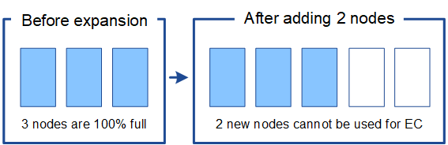

= StorageGRIDの拡張後の EC 再バランス調整について学ぶ
:allow-uri-read: 
:icons: font
:imagesdir: ../media/

[role="lead"]
拡張を実行してストレージノードを追加し、ILMルールを使用してデータをイレイジャーコーディングする場合、使用しているイレイジャーコーディングスキームに対応する十分な数のストレージノードを追加できない場合は、イレイジャーコーディング（EC）のリバランシング手順の実行が必要になることがあります。

これらの考慮事項を確認したら、拡張を実行し、に移動してlink:rebalancing-erasure-coded-data-after-adding-storage-nodes.html["ストレージノードの追加後にイレイジャーコーディングデータをリバランシングします"]手順を実行します。

== EC のリバランシングとは何ですか？

EC のリバランシングは、ストレージノードの拡張後に必要になる可能性がある StorageGRID 手順 です。手順 は、プライマリ管理ノードからコマンドラインスクリプトとして実行されます。ECのリバランシング手順 を実行すると、StorageGRID はサイトの既存のストレージノードと新しく追加したストレージノードにイレイジャーコーディングフラグメントを再配分します。

EC のリバランシング手順 ：

* イレイジャーコーディングされたオブジェクトデータのみを移動します。レプリケートされたオブジェクトデータは移動されません。
* サイト内のデータを再配布します。サイト間でデータを移動することはありません。
* サイトのすべてのストレージノードにデータを再配分します。ストレージボリューム内でデータが再配置されることはありません。
* 各ノードに同じバイト数を配布しようとします。より多くの複製データを含むノードでは、再バランスの完了後に、消失訂正符号化されたデータを保存する量が少なくなります。
* 各ノードの相対的な容量を考慮せずに、消去コード化されたデータをストレージ ノード間で均等に再配布します。複製されたデータも計算に含まれます。
* 80% を超えて使用されているストレージ ノードには、消去コード化されたデータは配布されません。
* イレイジャーコーディングフラグメントの再配置に追加リソースが必要になると、ILM処理とS3クライアント処理のパフォーマンスが低下する可能性があります。

EC Rebalance 手順 が完了すると、次のようになります。

* イレイジャーコーディングデータは、利用可能なスペースが少ないストレージノードから利用可能なスペースが多いストレージノードに移動されます。
* イレイジャーコーディングオブジェクトのデータ保護は変更されません。
* 次の2つの理由により、ストレージノード間で使用済み（%）の値が異なる可能性があります。
+
** レプリケートオブジェクトコピーは既存のノードのスペースを引き続き消費します。ECのリバランシング手順 では、レプリケートデータは移動されません。
** すべてのノードがほぼ同じ量のデータを持つことになりますが、容量の大きいノードは、容量の小さいノードよりも比較的いっぱいになりません。
+
たとえば、3つの200TBノードがそれぞれ80%使用されたとします（200&#215;0.8=160TB（サイトの場合は480TB）。400TBのノードを追加して手順 のリバランシングを実行すると、すべてのノードにほぼ同じ量のイレイジャーコーディングデータ（480 / 4 = 120TB）が格納されます。ただし、大きいノードの使用済み容量（%）は、小さいノードの使用済み容量（%）よりも少なくなります。

+
image::../media/used_space_with_larger_node.png[拡張前の使用済みスペース]

== イレイジャーコーディングデータをリバランシングするタイミング

EC 再バランス手順では、既存の消去符号化データを再分配して、ノードがいっぱいになったり、いっぱいになったままにならないようにします。この手順により、サイト上で EC エンコーディングを続行できるようになります。

サイト上のデータ分布に懸念される偏りがあり、サイトに主に EC データが格納されている場合は、再バランス手順を実行します (複製されたデータは再バランスによって移動できないため)。

次のシナリオを考えてみましょう。

* StorageGRID は、 3 つのストレージノードで構成される単一サイトで実行されています。
* ILMポリシーでは、1.0MBを超えるすべてのオブジェクトに2+1のイレイジャーコーディングルールを使用し、サイズの小さいオブジェクトには2-copyレプリケーションルールを使用します。
* すべてのストレージノードが完全にいっぱいになりました。Low Object Storage *アラートがMajor重大度レベルでトリガーされました。
+
image::../media/used_space_before_expansion.png[拡張前の使用済みスペース]

=== 十分な数のノードを追加した場合、リバランシングは必要ありません

ECのリバランシングが不要な状況を把握するために、新しいストレージノードを3つ以上追加したとします。この場合、ECリバランシングを実行する必要はありません。元のストレージノードはフルのままですが、新しいオブジェクトは3つの新しいノードを2+1のイレイジャーコーディングに使用します。2つのデータフラグメントと1つのパリティフラグメントを別 々 のノードに格納できます。

image::../media/used_space_after_3_node_expansion.png[3ノオトカクチヨウコノシヨウサイスヘエス]

CAUTION: この場合、ECのリバランシング手順 は実行できますが、既存のイレイジャーコーディングデータを移動するとグリッドのパフォーマンスが一時的に低下し、クライアント処理に影響する可能性があります。

=== 十分な数のノードを追加できない場合は、リバランシングが必要です

ECのリバランシングが必要な状況を把握するために、ストレージノードを3つではなく2つしか追加できないとします。2+1スキームでは、利用可能なスペースを確保するために少なくとも3つのストレージノードが必要であるため、空のノードを新しいイレイジャーコーディングデータに使用することはできません。

新しいストレージノードを使用するには、EC Rebalance手順 を実行する必要があります。この手順 を実行すると、StorageGRID はサイトのすべてのストレージノードに既存のイレイジャーコーディングデータフラグメントとパリティフラグメントを再配分します。この例では、ECのリバランシング手順が完了すると、5つのノードすべての使用率が60%に達し、すべてのストレージノードの2+1イレイジャーコーディングスキームに引き続きオブジェクトを取り込むことができます。

image::../media/used_space_after_ec_rebalance.png[EC の再バランスに使用した容量]

== ECのリバランシングに関する推奨事項

次のステートメントの_all_が当てはまる場合、ECのリバランシングが必要になります。

* オブジェクトデータにイレイジャーコーディングを使用します。
* Low Object Storage * アラートがトリガーされました。このアラートは、ノードが 80% 以上フルであることを示します。
* 使用中のイレイジャーコーディングスキームに使用する十分な数の新しいストレージノードを追加できません。を参照して link:adding-storage-capacity-for-erasure-coded-objects.html["イレイジャーコーディングオブジェクトのストレージ容量を追加します"]
* ECのリバランシング手順の実行中は、S3クライアントの書き込み処理と読み取り処理のパフォーマンスが低下しても問題ありません。

ストレージノードをほぼ同じレベルに配置し、S3クライアントがECのリバランシング手順の実行中に書き込み処理と読み取り処理のパフォーマンス低下を許容できる場合は、必要に応じてECのリバランシング手順を実行できます。

== EC のリバランシングが手順 と他のメンテナンスタスクと連携する仕組み

ECリバランシング手順 を実行するときに一部のメンテナンス手順を実行することはできません。

[cols="1a,2a"]
|===
| 手順 | EC のリバランシングで許可される手順 ？ 

 a| 
追加の EC リバランシング手順
 a| 
いいえ。

一度に実行できる EC のリバランシング手順 は 1 つだけです。

 a| 
手順 の運用を停止

EC データの修復ジョブ
 a| 
いいえ。

* EC Rebalance 手順 が実行されている間は、手順 または EC データの修復の運用を停止することはできません。
* ストレージノードが手順 を運用停止したり、 EC データの修復が実行されている間は、 EC のリバランシング手順 を開始できません。

 a| 
Expansion 手順 の略
 a| 
いいえ。

拡張時に新しいストレージノードを追加する必要がある場合は、すべての新しいノードを追加したあとにECリバランシング手順 を実行します。

 a| 
アップグレード手順
 a| 
いいえ。

StorageGRID ソフトウェアをアップグレードする必要がある場合は、EC rebalance手順 の実行前または実行後にアップグレード手順 を実行します。必要に応じて、ソフトウェアアップグレードを実行するために EC Rebalance 手順 を終了できます。

 a| 
アプライアンスノードのクローン手順
 a| 
いいえ。

アプライアンスストレージノードをクローニングする必要がある場合は、新しいノードの追加後にECリバランシング手順 を実行します。

 a| 
Hotfix 手順 の略
 a| 
はい。

StorageGRID ホットフィックスは、 EC Rebalance 手順 の実行中に適用できます。

 a| 
その他のメンテナンス手順
 a| 
いいえ。

他のメンテナンス手順を実行する前に、 EC Rebalance 手順 を終了する必要があります。

|===

== EC のリバランシングが行われる手順 と ILM の相互作用

EC のリバランシング手順 を実行している間は、 ILM を変更して既存のイレイジャーコーディングオブジェクトの場所が変更されないようにしてください。たとえば、イレイジャーコーディングプロファイルが異なるILMルールは使用しないでください。このようなILMの変更が必要な場合は、ECのリバランシング手順 を終了する必要があります。
