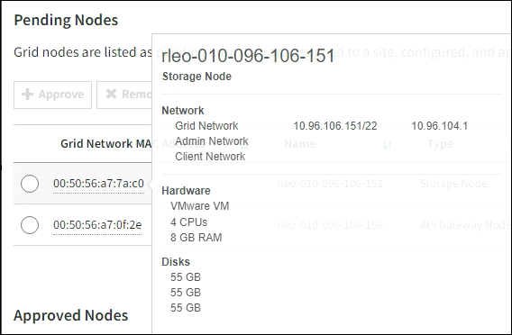

= StorageGRID拡張を実行する
:allow-uri-read: 
:icons: font
:imagesdir: ../media/

[role="lead"]
拡張を行うと、新しいグリッドノードが既存の StorageGRID 環境に追加されます。

.開始する前に
* Grid Managerにサインインしておきますlink:../admin/web-browser-requirements.html["サポートされている Web ブラウザ"]。
* プロビジョニングパスフレーズを用意します。
* この拡張で追加するすべてのグリッドノードの導入が完了している。
* あなたはを持っていますlink:../admin/admin-group-permissions.html["Maintenance権限またはRoot Access権限"]。
* ストレージノードを追加する場合は、リカバリの一環として実行されるデータ修復処理がすべて完了したことを確認しておきます。を参照して link:../maintain/checking-data-repair-jobs.html["データ修復ジョブを確認します"]
* ストレージノードを追加していて、それらのノードにカスタムのストレージグレードを割り当てる場合は、が完了している必要link:../ilm/creating-and-assigning-storage-grades.html["カスタムのストレージグレードを作成しました"]があります。また、Root access権限、またはMaintenance権限とILM権限の両方が必要です。
* 新しいサイトを追加する場合は、ILMルールの確認と更新を完了しておきます。拡張が完了するまでオブジェクトコピーが新しいサイトに格納されないようにする必要があります。たとえば、ルールでデフォルトのストレージプール（* All Storage Nodes *）が使用されている場合は、既存のストレージノードとその新しいストレージプールを使用するILMポリシーのみを含むlink:../ilm/working-with-ilm-rules-and-ilm-policies.html["ILMルールを更新"]必要がありますlink:../ilm/creating-storage-pool.html["新しいストレージプールを作成します"]。そうしないと、そのサイトの最初のノードがアクティブになるとすぐに新しいサイトにオブジェクトがコピーされます。

.タスクの内容
拡張の実行には、次の主なユーザタスクが含まれます。

. 拡張を設定します。
. 拡張を開始します。
. 新しいリカバリ パッケージ ファイルをダウンロードします。
. すべての新しいノードのインストールと設定が完了し、すべてのサービスが開始されるまで、拡張の手順と段階を監視します。
+

CAUTION: 大規模なグリッドでは、拡張の手順や段階によっては実行にかなりの時間がかかることがあります。たとえば、新しいストレージノードへの Cassandra のストリーミングは、 Cassandra データベースが空の場合は数分程度で完了します。ただし、 Cassandra データベースに大量のオブジェクトメタデータが含まれている場合は、数時間以上かかることがあります。「Cassandraクラスタの拡張」または「Starting Cassandra and streaming data」のステージの間は、ストレージノードをリブートしないでください。

.手順
. *メンテナンス* > *タスク* > *拡張*を選択します。
+
Grid Expansion ページが表示されます。[Pending Nodes]セクションには、追加の準備が完了したノードが表示されます。

+
image::../media/grid_expansion_page.png[グリッドの拡張ページを示すスクリーンショット]

. [ 拡張の構成 ] を選択します。
+
[ サイトの選択 ] ダイアログボックスが表示されます。

. 開始する拡張のタイプを選択します。
+
** 新しいサイトを追加する場合は、「 * 新規」を選択し、新しいサイトの名前を入力します。
** 既存のサイトにノードを追加する場合は、* Existing *を選択します。

. [ 保存（ Save ） ] を選択します。
. 「 * Pending Nodes * 」のリストを確認し、導入したすべてのグリッドノードが表示されていることを確認します。
+
必要に応じて、ノードの*[Grid Network MAC Address]*にカーソルを合わせると、そのノードに関する詳細を確認できます。

+

+

NOTE: ノードが見つからない場合は、ノードが正常に導入されたことを確認します。

. 保留状態のノードのリストで、この拡張で追加するノードを承認します。
+
.. 承認する最初の保留中のグリッドノードの横にあるラジオボタンを選択します。
.. [* 承認（ Approve ） ] を選択し
+
グリッドノードの設定フォームが表示されます。

.. 必要に応じて、一般設定を変更します。
+
[cols="1a,2a"]
|===
| フィールド | 製品説明 

 a| 
サイト
 a| 
グリッドノードを関連付けるサイトの名前。複数のノードを追加する場合は、各ノードに適したサイトを選択してください。新しいサイトを追加する場合は、すべてのノードが新しいサイトに追加されます。

 a| 
名前
 a| 
ノードのシステム名。システム名は内部StorageGRID 処理に必要であり、変更することはできません。

 a| 
ストレージタイプ（ストレージノードのみ）
 a| 
*** *データとメタデータ*（「組み合わせ」）：オブジェクトデータとメタデータのストレージノード
*** *データ専用*：オブジェクトデータのみ（メタデータなし）を含むストレージノード
*** *メタデータのみ*：メタデータのみを含むストレージノード（オブジェクトデータは含まれない）

 a| 
NTP ロール
 a| 
グリッドノードのNetwork Time Protocol（NTP；ネットワークタイムプロトコル）ロール。

*** ノードにNTPロールを自動的に割り当てる場合は、* Automatic *（デフォルト）を選択します。Primaryロールは、管理ノード、ADCサービスを使用するストレージノード、ゲートウェイノード、および非静的IPアドレスが設定されたグリッドノードに割り当てられます。Clientロールは他のすべてのグリッドノードに割り当てられます。
*** プライマリNTPロールを手動でノードに割り当てるには、*[プライマリ]*を選択します。外部タイミングソースへの冗長システムアクセスを提供するには、各サイトの少なくとも2つのノードにPrimaryロールが必要です。
*** クライアントNTPロールをノードに手動で割り当てるには、*[クライアント]*を選択します。

 a| 
ADCサービス（統合ストレージノードまたはメタデータ専用ストレージノード）
 a| 
このストレージ ノードが管理ドメイン コントローラ (ADC) サービスを実行するかどうか。 ADC サービスは、グリッド サービスの場所と可用性を追跡します。各サイトの少なくとも 3 つのストレージ ノードに ADC サービスが含まれている必要があります。

*** 交換するストレージ ノードに ADC サービスが含まれている場合は、[*はい*] を選択します。残っている ADC サービスが少なすぎる場合はストレージ ノードを廃止できないため、この設定により、古いサービスが削除される前に新しい ADC サービスが利用可能になります。
*** あなたはできるlink:../maintain/move-adc-service.html["ADC サービスを同じサイト内の別のストレージノードに移動する"]ADC サービスのクォーラムが満たされていることを確認します。
*** このノードにADCサービスが必要かどうかをシステムで自動的に判断するには、*[Automatic]*を選択します。

については、を参照してlink:../maintain/understanding-adc-service-quorum.html["ADCクォーラム"]ください。

 a| 
ストレージグレード（組み合わせたストレージノードまたはデータ専用ストレージノード）
 a| 
デフォルト*のストレージグレードを使用するか、この新しいノードに割り当てるカスタムのストレージグレードを選択します。

ストレージグレードはILMストレージプールで使用されるため、選択内容がストレージノードに配置されるオブジェクトに影響する可能性があります。

|===
.. 必要に応じて、グリッドネットワーク、管理ネットワーク、およびクライアントネットワークの設定を変更します。
+
*** * IPv4 Address （ CIDR ） * ：ネットワークインターフェイスの CIDR ネットワークアドレス。例： 172.16.10.100/24
+

NOTE: ノードの承認中にグリッドネットワークでノードのIPアドレスが重複していることがわかった場合は、拡張をキャンセルし、重複しないIPで仮想マシンまたはアプライアンスを再導入してから、拡張を再開する必要があります。

*** * Gateway * ：グリッドノードのデフォルトゲートウェイ。例： 172.16.10.1
*** * Subnets （ CIDR ） * ：管理ネットワーク用の 1 つ以上のサブネットワーク。

.. [ 保存（ Save ） ] を選択します。
+
承認済みグリッドノードが [ 承認済みノード ] リストに移動します。

+
*** 承認済みグリッドノードのプロパティを変更するには、そのラジオボタンを選択し、 * 編集 * を選択します。
*** 承認済みのグリッドノードを保留中のノードのリストに戻すには、該当するオプションボタンを選択し、 * リセット * を選択します。
*** 承認済みのグリッドノードを完全に削除するには、ノードの電源をオフにします。次に、そのラジオボタンを選択し、 * 削除 * を選択します。

.. 承認する保留中のグリッドノードごとに、上記の手順を繰り返します。
+

NOTE: 可能であれば、保留中のグリッドノードをすべて承認し、 1 回の拡張を実施してください。小規模な拡張を複数回実施すると、さらに時間がかかります。

. すべてのグリッドノードを承認したら、「 * プロビジョニングパスフレーズ」と入力し、「 * 拡張」を選択します。
+
数分後にページが更新され、拡張手順 のステータスが表示されます。個 々 のグリッドノードに影響するタスクが進行中の場合、[Grid Node Status]セクションに各グリッドノードの現在のステータスが表示されます。

+

NOTE: 新しいアプライアンスの「グリッドノードのインストール」の手順で、StorageGRIDアプライアンスインストーラのインストールがステージ3からステージ4の「インストールの完了」に移動します。ステージ 4 が完了すると、コントローラがリブートします。

+

NOTE: サイトの拡張には、新しいサイト用の Cassandra を設定するための追加タスクが含まれます。

. *リカバリ パッケージのダウンロード* リンクが表示されたらすぐに、リカバリ パッケージ ファイルをダウンロードします。
+
StorageGRIDシステムのグリッド トポロジを変更した後は、できるだけ早くリカバリ パッケージ ファイルの更新されたコピーをダウンロードする必要があります。リカバリ パッケージ ファイルを使用すると、障害が発生した場合にシステムを復元できます。

+
.. ダウンロードリンクを選択します。
.. プロビジョニングパスフレーズを入力し、 * ダウンロードの開始 * を選択します。
.. ダウンロードが完了したら、ファイルを開き `.zip`、ファイルを含むコンテンツにアクセスできることを確認し `Passwords.txt`ます。
.. ダウンロードしたリカバリパッケージファイルをコピーします(`.zip`) を 2 つの安全でセキュリティ保護された別の場所に保管します。
+

CAUTION: リカバリ パッケージ ファイルには、 StorageGRIDシステムからデータを取得するために使用できる暗号化キーとパスワードが含まれているため、セキュリティで保護する必要があります。

. 既存のサイトにストレージノードを追加する場合やサイトを追加する場合は、新しいグリッドノードでサービスが開始されたときにCassandraステージを監視します。
+

CAUTION: 「Cassandraクラスタの拡張」または「Starting Cassandra and streaming data」段階の間は、ストレージノードをリブートしないでください。特に既存のストレージノードに大量のオブジェクトメタデータが含まれている場合、これらのステージは新しいストレージノードごとに完了するまでに数時間かかることがあります。

+
[role="tabbed-block"]
====
.ストレージノードの追加
--
既存のサイトにストレージノードを追加する場合は、「Starting Cassandra and streaming data」ステータスメッセージに表示される割合を確認します。

この割合は、使用可能な Cassandra データの合計量と、新しいノードに書き込み済みの量に基づいて、 Cassandra のストリーミング処理の進捗状況から概算したものです。

--
.サイトを追加しています
--
新しいサイトを追加する場合は、を使用して `nodetool status`Cassandraストリーミングの進捗状況を監視し、「Cassandraクラスタの拡張」段階で新しいサイトにコピーされたメタデータの量を確認します。新しいサイトの総データ負荷は、現在のサイトの合計の約 20% 以内である必要があります。

--
====
. すべてのタスクが完了し、 * 拡張の設定 * ボタンが再表示されるまで、拡張の監視を続けます。

.終了後
追加したグリッドノードのタイプに応じて、統合と設定に関する追加の手順を実行します。を参照して link:configuring-expanded-storagegrid-system.html["拡張後の設定手順"]
