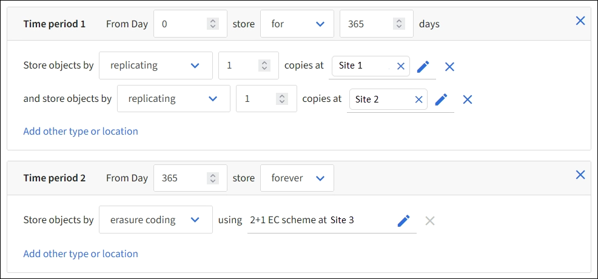

= ステップ 2 / 3 ：配置を定義する
:allow-uri-read: 
:icons: font
:imagesdir: ../media/

[role="lead"]
Create ILM Ruleウィザードの* Define placements *ステップでは、オブジェクトを格納する期間、コピーのタイプ（レプリケートまたはイレイジャーコーディング）、格納場所、およびコピー数を決定する配置手順を定義できます。

NOTE: ここに示されているスクリーンショットは一例です。StorageGRIDのバージョンによっては、結果が異なる場合があります。

.タスクの内容
ILM ルールには 1 つ以上の配置手順を含めることができます。各配置手順環境 は一定期間です。複数の手順を使用する場合は、期間が連続していて、少なくとも 1 つの手順が 0 日目に開始されている必要があります。手順は無期限に、またはオブジェクトコピーが不要になるまで継続できます。

複数のタイプのコピーを作成する場合や、期間中に別々の場所を使用する場合は、各配置手順に複数の行を追加することができます。

この例では、ILMルールはサイト1にレプリケートコピーを1つ、サイト2にレプリケートコピーを1つ、最初の1年間格納します。1 年後、 2+1 のイレイジャーコーディングコピーが作成され、 1 つのサイトにのみ保存されます。

.手順
. [Reference time]*で、配置手順の開始時間の計算に使用する時間のタイプを選択します。
+
[cols="1a,2a"]
|===
| オプション | 製品説明 

 a| 
取り込み時間
 a| 
オブジェクトが取り込まれた時間。

 a| 
最終アクセス時間
 a| 
オブジェクトが最後に読み出された（読み取られた、または表示された）時間。

このオプションを使用するには、S3バケットに対して最終アクセス時間の更新を有効にする必要があります。を参照してください link:using-last-access-time-in-ilm-rules.html["ILMルールで最終アクセス時間を使用"]。

 a| 
ユーザ定義の作成時間
 a| 
ユーザ定義のメタデータで指定された時間。

 a| 
最新でない時間
 a| 
の質問「Apply this rule to older object versions only（S3バケットでバージョン管理が有効になっている場合）？」で* Yes *を選択すると、「noncurrent time」が自動的に選択されますlink:create-ilm-rule-enter-details.html["ILMルール作成ウィザードのステップ1"]。

|===
+
_compliant_ruleを作成する場合は、*取り込み時間*を選択する必要があります。を参照してください link:managing-objects-with-s3-object-lock.html["S3 オブジェクトロックでオブジェクトを管理します"]。

. [Time period and placements *]セクションで、最初の期間の開始時刻と期間を入力します。
+
たとえば、最初の年にオブジェクトを格納する場所（_ from day 0 store for 365 days_）を指定できます。少なくとも 1 つの手順は 0 日目から開始する必要があります。

. レプリケートコピーを作成する場合は、次の手順を実行します。
+
.. [Store objects by]*ドロップダウンリストで、*[Replicating]*を選択します。
.. 作成するコピーの数を選択します。
+
コピー数を 1 に変更すると、警告が表示されます。ある期間にレプリケートコピーを 1 つしか作成しない ILM ルールには、データが永続的に失われるリスクがあります。を参照してください link:why-you-should-not-use-single-copy-replication.html["シングルコピーレプリケーションを使用しない理由"]。

+
このリスクを回避するには、次のいずれかまたは複数の操作を実行します。

+
*** 期間のコピー数を増やします。
*** 他のストレージプールまたはクラウドストレージプールにコピーを追加します。
*** [レプリケート中]*ではなく、*[イレイジャーコーディング]*を選択します。
+
このルールですべての期間に対して複数のコピーを作成するようすでに定義されている場合は、この警告を無視してかまいません。

.. [コピー数]*フィールドで、追加するストレージプールを選択します。
+
* ストレージプールを 1 つしか指定しない場合、 StorageGRID は 1 つのオブジェクトのレプリケートコピーを任意のストレージノードに 1 つだけ格納できます。3つのストレージノードがあるグリッドでコピー数として4を選択した場合、ストレージノードごとに1つのコピーが作成されるのは3つだけです。

+
ILM placement unAchievable * アラートがトリガーされ、 ILM ルールを完全に適用できなかったことを示します。

+
* 複数のストレージプールを指定する場合は、次の点に注意してください。 *

+
*** コピーの数をストレージプールの数よりも多くすることはできません。
*** コピーの数がストレージプールの数と同じ場合は、オブジェクトのコピーが 1 つずつ各ストレージプールに格納されます。
*** コピーの数がストレージプールの数より少ない場合は、取り込みサイトに1つのコピーが格納され、残りのコピーがプール間のディスク使用量のバランスを維持するために分散されます。同時に、どのサイトもオブジェクトのコピーを複数取得できないようにします。
*** ストレージプールが重複している（同じストレージノードを含んでいる）場合は、オブジェクトのすべてのコピーが 1 つのサイトにのみ保存される可能性があります。そのため、All Storage Nodesストレージプール（StorageGRID 11.6以前）と別のストレージプールを指定しないでください。

. イレイジャーコーディングコピーを作成する場合は、次の手順を実行します。
+
.. [Store objects by *]ドロップダウンリストで、*イレイジャーコーディング*を選択します。
+

NOTE: イレイジャーコーディングは 1MB を超えるオブジェクトに適しています。非常に小さいイレイジャーコーディングフラグメントを管理するオーバーヘッドを回避するために、200KB未満のオブジェクトにはイレイジャーコーディングを使用しないでください。

.. 200KBを超える値に対してオブジェクトサイズフィルタを追加しなかった場合は、* Previous *を選択して手順1に戻ります。次に、*[高度なフィルタを追加する]*を選択し、*[オブジェクトサイズ]*フィルタを200KBを超える任意の値に設定します。
.. 追加するストレージプールと使用するイレイジャーコーディングスキームを選択します。
+
イレイジャーコーディングコピーの格納場所は、イレイジャーコーディングスキームの名前とストレージプールの名前で構成されます。

+
使用可能なイレイジャーコーディングスキームは、選択したストレージプール内のストレージノードの数によって制限されます。いずれかのを提供するスキームの横にバッジが `Recommended`表示されlink:../ilm/what-erasure-coding-schemes-are.html["最適な保護または最小限のストレージオーバーヘッド"]ます。

. オプション：
+
.. 別の場所に追加のコピーを作成するには、*[その他のタイプまたは場所を追加]*を選択します。
.. 別の期間を追加するには、*[別の期間を追加]*を選択します。
+
[NOTE]
====
オブジェクトの削除は次の設定に基づいて実行されます。

*** 別の期間が「* forever *」で終わる場合を除き、最後の期間の終了時にオブジェクトが自動的に削除されます。
*** によってはlink:../ilm/example-8-priorities-for-s3-bucket-lifecycle-and-ilm-policy.html#example-of-bucket-lifecycle-taking-priority-over-ilm-policy["バケットとテナントの保持期間の設定"]、ILMの保持期間が終了してもオブジェクトが削除されない場合があります。

====

. オブジェクトをクラウドストレージプールに格納する場合は、次の手順を実行します。
+
.. [Store objects by *]ドロップダウンリストで、*[Replicating *]を選択します。
.. [Copies at]*フィールドを選択し、クラウドストレージプールを選択します。
+
クラウドストレージプールを使用する場合は、次の点に注意してください。

+
*** 1つの配置手順で複数のクラウドストレージプールを選択することはできません。同様に、クラウドストレージプールとストレージプールを同じ配置手順で選択することはできません。
*** 任意のクラウドストレージプールに格納できるオブジェクトのコピーは 1 つだけです。「 * Copies * 」を 2 以上に設定すると、エラーメッセージが表示されます。
*** どのクラウドストレージプールにも、複数のオブジェクトコピーを同時に格納することはできません。クラウドストレージプールを使用する複数の配置で日付が重複している場合や、同じ配置内の複数の行でクラウドストレージプールを使用している場合は、エラーメッセージが表示されます。
*** オブジェクトがStorageGRIDにレプリケートコピーまたはイレイジャーコーディングコピーとして格納されているときに、そのオブジェクトをクラウドストレージプールに格納できます。ただし、各場所のコピーの数とタイプを指定できるように、その期間の配置手順に複数の行を含める必要があります。

. [Retention]図で、配置手順を確認します。
+
この例では、ILMルールはサイト1にレプリケートコピーを1つ、サイト2にレプリケートコピーを1つ、最初の1年間格納します。1年後にさらに10年間、6+3のイレイジャーコーディングコピーが3つのサイトに保存されます。合計11年が経過すると、オブジェクトはStorageGRID から削除されます。

+
保持図の規則解析セクションには'次のような情報が表示されます

+
** このルールの期間中は、StorageGRID サイト障害からの保護が適用されます。
** このルールで処理されるオブジェクトは、4015日目以降に削除されます。
+
を参照して link:using-multiple-storage-pools-for-cross-site-replication.html["サイト障害からの保護を有効にします。"]

+
image::../media/ilm_rule_retention_diagram.png[ILM ルールによる保持の図]

. 「 * Continue * 」を選択します。link:create-ilm-rule-select-ingest-behavior.html["ステップ3（取り込み動作を選択）"]のCreate an ILM ruleウィザードが表示されます。

