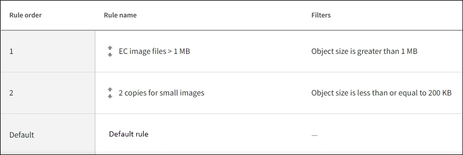

= 例 3 ：画像ファイルの保護を強化する ILM ルールとポリシー
:allow-uri-read: 
:icons: font
:imagesdir: ../media/

[role="lead"]
次の例のルールとポリシーを使用して、1MBを超えるイメージがイレイジャーコーディングされ、2つのコピーが小さいイメージで作成されるようにすることができます。

CAUTION: 以下の ILM ルールとポリシーは一例にすぎません。ILM ルールを設定する方法は多数あります。新しいポリシーをアクティブ化する前に、ポリシーをシミュレートして、コンテンツを損失から保護するために意図したとおりに機能することを確認します。

== 例 3 の ILM ルール 1 ： 1MB を超える画像ファイルに EC を使用します

この ILM ルールの例では、高度なフィルタリングを使用して、 1MB を超えるすべてのイメージファイルをイレイジャーコーディングします。

NOTE: イレイジャーコーディングは 1MB を超えるオブジェクトに適しています。非常に小さいイレイジャーコーディングフラグメントを管理するオーバーヘッドを回避するために、200KB未満のオブジェクトにはイレイジャーコーディングを使用しないでください。

[cols="1a,2a"]
|===
| ルール定義 | 値の例 

 a| 
ルール名
 a| 
ECイメージファイルが1MBを超えています

 a| 
参照時間
 a| 
取り込み時間

 a| 
オブジェクトサイズの高度なフィルタ
 a| 
オブジェクトサイズが1MBを超えています

 a| 
キーの高度なフィルタ
 a| 
* 末尾は.jpgです
* 末尾は.pngです

 a| 
配置
 a| 
3 つのサイトを使用して 2+1 のイレイジャーコーディングコピーを作成

|===
image::../media/policy_3_rule_1_ec_images_adv_filtering.png[例 3 の ILM ルール 1 ： 1MB を超える画像ファイルに EC を使用します]

このルールはポリシー内の最初のルールとして設定されているため、イレイジャーコーディング配置手順には1MBを超える環境 の.jpgファイルと.pngファイルのみが含まれます。

== 例 3 の ILM ルール 2 ：残りのすべてのイメージファイルに対してレプリケートコピーを 2 つ作成します

この ILM ルールの例では、高度なフィルタリングを使用して、より小さなイメージファイルをレプリケートするように指定します。ポリシーの最初のルールは 1MB より大きい画像ファイルにすでに一致しているため、このルールは 1MB 以下の環境 画像ファイルを示します。

[cols="1a,2a"]
|===
| ルール定義 | 値の例 

 a| 
ルール名
 a| 
イメージファイル用に2コピー

 a| 
参照時間
 a| 
取り込み時間

 a| 
キーの高度なフィルタ
 a| 
* 末尾は.jpgです
* 末尾は.pngです

 a| 
配置
 a| 
2つのストレージプールにレプリケートコピーを2つ作成します

|===

== 例 3 の ILM ポリシー：画像ファイルの保護の強化

この例の ILM ポリシーには 3 つのルールが含まれています

* 最初のルールのイレイジャーコーディングでは、 1MB を超えるすべてのイメージファイルをイレイジャーコーディングします。
* 2 番目のルールは、残りのすべてのイメージファイル（ 1MB 以下のイメージ）のコピーを 2 つ作成します。
* デフォルトルールでは、残りのすべてのオブジェクト（画像以外のファイル）が環境 されます。

