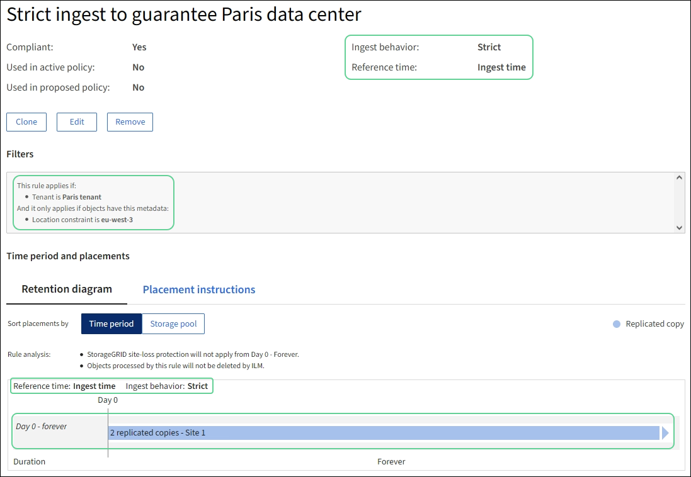

= 例 5 ：取り込み動作が Strict の場合の ILM ルールとポリシー
:allow-uri-read: 
:icons: font
:imagesdir: ../media/

[role="lead"]
ルールで場所フィルタと Strict 取り込み動作を使用すると、特定のデータセンターの場所にオブジェクトが保存されないようにすることができます。

この例では、規制上の問題により、パリベースのテナントは EU の外部に一部のオブジェクトを格納しないようにしています。他のテナントアカウントのすべてのオブジェクトを含むその他のオブジェクトは、パリデータセンターまたは米国のデータセンターに格納できます。

CAUTION: 以下の ILM ルールとポリシーは一例にすぎません。ILM ルールを設定する方法は多数あります。新しいポリシーをアクティブ化する前に、ポリシーをシミュレートして、コンテンツを損失から保護するために意図したとおりに機能することを確認します。

.関連情報
* link:data-protection-options-for-ingest.html["取り込みオプション"]
* link:create-ilm-rule-select-ingest-behavior.html["Create ILM rule：取り込み動作を選択します"]

== 例 5 の ILM ルール 1 ：パリデータセンターを確保するための Strict 取り込み

この ILM ルールの例では Strict 取り込み動作を使用して、パリベースのテナントによって S3 バケットに保存されたオブジェクトのリージョンが eu-west-3 リージョン（パリ）に設定されたものが米国のデータセンターに格納されないようにします。

このルールは、パリテナントに属し、 S3 バケットリージョンが eu-west-3 （パリ）に設定されている環境 オブジェクトを示します。

[cols="1a,2a"]
|===
| ルール定義 | 値の例 

 a| 
テナントアカウント
 a| 
パリのテナント

 a| 
高度なフィルタ
 a| 
ロケーションの制約はeu-west-3に等しくなります

 a| 
ストレージプール
 a| 
サイト1（パリ）

 a| 
ルール名
 a| 
厳格な取り込みにより、パリのデータセンターを保証します

 a| 
参照時間
 a| 
取り込み時間

 a| 
配置
 a| 
0日目から2つのレプリケートコピーをサイト1（パリ）に無期限に格納

 a| 
取り込み動作
 a| 
厳しい取り込み時に必ずこのルールの配置手順を使用してください。パリデータセンターにオブジェクトのコピーを 2 つ保存できない場合、取り込みは失敗します。

|===

== 例 5 の ILM ルール 2 ：他のオブジェクトに対してバランスのとれた取り込み

この ILM ルールの例では、 Balanced 取り込み動作を使用して、最初のルールに一致しないオブジェクトの ILM 効率が最適化されます。このルールに一致するすべてのオブジェクトのコピーが 2 つ保存されます。 1 つは米国データセンターに、もう 1 つはパリデータセンターに格納されます。ルールをすぐに満たすことができない場合は、使用可能な任意の場所に中間コピーが格納されます。

このルールは、任意のテナントおよびすべてのリージョンに属する環境 オブジェクトを対象としています。

[cols="1a,2a"]
|===
| ルール定義 | 値の例 

 a| 
テナントアカウント
 a| 
無視

 a| 
高度なフィルタ
 a| 
_ 指定されていません _

 a| 
ストレージプール
 a| 
サイト1（パリ）およびサイト2（米国）

 a| 
ルール名
 a| 
2 つのコピーで 2 つのデータセンター

 a| 
参照時間
 a| 
取り込み時間

 a| 
配置
 a| 
0 日目から、 2 つのレプリケートコピーを 2 つのデータセンターに無期限に格納します

 a| 
取り込み動作
 a| 
中間（ Balanced ）：このルールに一致するオブジェクトは、可能であればルールの配置手順に従って配置されます。それ以外の場合、中間コピーは任意の空き場所で作成されます。

|===

== 例 5 の ILM ポリシー：取り込み動作を組み合わせたもの

この例の ILM ポリシーには、取り込み動作が異なる 2 つのルールが含まれています。

2 つの異なる取り込み動作を使用する ILM ポリシーには、次のような ILM ルールが含まれる場合があります。

* パリのテナントに属し、かつ S3 バケットリージョンがパリのデータセンター内でのみ eu-west-3 （パリ）に設定されているオブジェクトを格納します。パリのデータセンターが利用できない場合は取り込みに失敗します。
* その他のすべてのオブジェクト（パリテナントに属しているものの、バケットリージョンが異なるオブジェクトを含む）は、米国のデータセンターとパリのデータセンターの両方に保存します。配置手順を満たすことができない場合は、使用可能な任意の場所に中間コピーを作成します。

この例のポリシーをシミュレートすると、テストオブジェクトは次のように評価されます。

* パリのテナントに属し、 S3 バケットリージョンが eu-west-3 に設定されているオブジェクトはすべて最初のルールに一致し、パリのデータセンターに格納されます。最初のルールでは Strict 取り込みが使用されるため、これらのオブジェクトが米国のデータセンターに格納されることはありません。パリのデータセンターのストレージノードを使用できない場合、取り込みは失敗します。
* その他のオブジェクト（パリのテナントに属するオブジェクトでS3バケットのリージョンがeu-west-3に設定されていないオブジェクトを含む）はすべて2つ目のルールに一致します。各オブジェクトのコピーが各データセンターに 1 つずつ保存されます。ただし、 2 つ目のルールでは Balanced ing( バランスの取れた取り込み ) が使用されるため、 1 つのデータセンターが使用できない場合は、使用可能な任意の場所に 2 つの中間コピーが保存されます。

