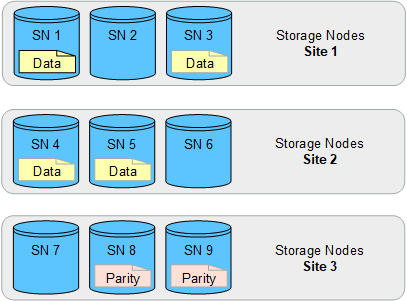

= サイト障害からの保護を有効にします
:allow-uri-read: 
:icons: font
:imagesdir: ../media/

[role="lead"]
StorageGRID 環境に複数のサイトが含まれている場合は、レプリケーションとイレイジャーコーディングを適切に設定されたストレージプールで使用して、サイト障害から保護することができます。

レプリケーションとイレイジャーコーディングでは、次のように異なるストレージプール構成が必要です。

* レプリケーションを使用してサイト障害から保護するには、StorageGRID のインストール時に自動的に作成されるサイト固有のストレージプールを使用します。次に、各オブジェクトのコピーが各サイトに1つ配置されるように、複数のストレージプールを指定するILMルールを作成しますlink:create-ilm-rule-define-placements.html["配置手順"]。
* イレイジャーコーディングを使用してサイト障害から保護する場合は、をlink:guidelines-for-creating-storage-pools.html#guidelines-for-storage-pools-used-for-erasure-coded-copies["複数のサイトで構成されるストレージプールを作成します"]参照してください。次に、複数のサイトで構成される1つのストレージプールと使用可能なイレイジャーコーディングスキーマを使用するILMルールを作成します。

CAUTION: StorageGRID環境でサイト障害からの保護を設定する場合は、およびの影響も考慮する必要がありますlink:data-protection-options-for-ingest.html["取り込みオプション"]link:../s3/consistency.html["一貫性"]。

== レプリケーションの例

デフォルトでは、StorageGRID のインストール時にサイトごとに1つのストレージプールが作成されます。ストレージプールが1つのサイトだけで構成されていると、レプリケーションを使用してサイト障害から保護するILMルールを設定できます。次の例では、

* ストレージプール1にサイト1が含まれている
* ストレージプール2にサイト2が含まれている
* ILMルールには次の2つの配置が含まれています。
+
** サイト1に1つのコピーをレプリケートしてオブジェクトを格納します
** サイト2に1つのコピーをレプリケートしてオブジェクトを格納します

ILMルールの配置：

image::../media/ilm_replication_at_2_sites.png[それぞれ1つのコピーを2つのサイトにレプリケート]

image::../media/ilm_replication_make_2_copies_2_pools_2_sites.png[サイト固有の2つのストレージプールにそれぞれ1つのコピーを作成します]

一方のサイトが失われると、もう一方のサイトでオブジェクトのコピーを使用できるようになります。

== イレイジャーコーディングの例

ストレージプールごとに複数のサイトで構成されるストレージプールを用意すると、イレイジャーコーディングを使用してサイト障害から保護するILMルールを設定できます。次の例では、

* ストレージプール1にサイト1~3が含まれています
* ILMルールには配置が1つ含まれています。3つのサイトからなるストレージプール1で4+2 ECスキームを使用してオブジェクトをイレイジャーコーディングして格納します

ILMルールの配置：

image::../media/ilm_erasure_coding_site_loss_protection_4+2.png[EC 1ストレージプール9ストレージノード3サイト]

次の例では、

* ILMルールでは4+2のイレイジャーコーディングスキームを使用します。
* 各オブジェクトは 4 つのデータフラグメントに等分され、オブジェクトデータから 2 つのパリティフラグメントが計算されます。
* ノードやサイトの障害時にもデータが保護されるよう、 6 つの各フラグメントは 3 つのデータセンターサイトの別々のノードに格納されます。

NOTE: イレイジャーコーディングは、sites_except_twoサイトを任意の数含むストレージプールで許可されます。

4+2のイレイジャーコーディングスキームを使用するILMルール：

一方のサイトが失われても、データは引き続きリカバリできます。

image::../media/ec_three_sites_4_plus_2_site_loss_example.png[イレイジャーコーディング4+2 ECスキーム1サイトが失われました]
