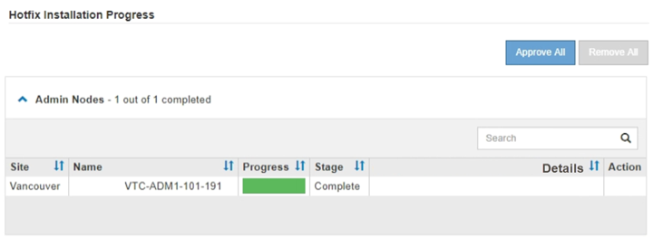

= ホットフィックスを適用する
:allow-uri-read: 
:icons: font
:imagesdir: ../media/

[role="lead"]
ホットフィックスは、最初にプライマリ管理ノードに自動的に適用されます。その後、すべてのノードが同じバージョンのソフトウェアを実行するまでの間、他のグリッドノードへのホットフィックスの適用を承認する必要があります。個々のグリッドノード、グリッドノードのグループ、またはすべてのグリッドノードを選択して、承認順序をカスタマイズできます。

.開始する前に
* を確認しておきますlink:storagegrid-hotfix-procedure.html["ホットフィックスの適用に関する考慮事項"]。
* プロビジョニングパスフレーズを用意します。
* Rootアクセス権限またはMaintenance権限が必要です。

.タスクの内容
* ホットフィックスのノードへの適用は遅延できますが、ホットフィックスの適用はすべてのノードにホットフィックスを適用するまで完了しません。
* ホットフィックスプロセスが完了するまで、StorageGRID ソフトウェアのアップグレードやSANtricity OSの更新は実行できません。

.手順
. を使用してGrid Managerにサインインしlink:../admin/web-browser-requirements.html["サポートされている Web ブラウザ"]ます。
. 「 * maintenance * > * System * > * Software update * 」を選択します。
+
Software Update ページが表示されます。

+
image::../media/software_update_landing.png[ソフトウェアアップデートのランディングページ]

. [ * ホットフィックスの適用 * ] を選択します。
+
StorageGRID Hotfix ページが表示されます。

+
image::../media/hotfix_choose_file.png[ホットフィックス [ ファイル ] を選択します]

. NetApp Support Site からダウンロードしたホットフィックスファイルを選択します。
+
.. [ * 参照 * ] を選択します。
.. ファイルを探して選択します。
+
`hotfix-install-_version_`

.. 「 * 開く * 」を選択します。
+
ファイルがアップロードされます。アップロードが完了すると、ファイル名が [ 詳細 ] フィールドに表示されます。

+

NOTE: ファイル名は検証プロセスの一部であるため、変更しないでください。

. プロビジョニングパスフレーズをテキストボックスに入力します。
+
「 * Start * （スタート * ）」ボタンが有効になります。

. 「 * Start （開始）」を選択します
+
プライマリ管理ノードのサービスを再起動する際にブラウザの接続が一時的に失われる可能性があることを示す警告が表示されます。

. [OK] を選択して、プライマリ管理ノードへのホットフィックスの適用を開始します。
+
ホットフィックスの適用が開始されると、次

+
.. ホットフィックスの検証が実行されます。
+

NOTE: エラーが報告された場合は解決し、ホットフィックスファイルを再アップロードして、 * Start * を再度選択します。

.. ホットフィックスのインストールの進行状況の表が表示されます。
+
この表には、グリッド内のすべてのノードと、ホットフィックスのインストールの現在のステージがノードごとに表示されます。テーブル内のノードは、タイプ（管理ノード、ゲートウェイノード、ストレージノード）別にグループ化されています。

.. 進行状況バーが完了すると、プライマリ管理ノードが「Complete」と表示されます。
+

. 必要に応じて、各グループ内のノードのリストを * Site * 、 * Name * 、 * Progress * 、 * Stage * 、または * Details * で昇順または降順にソートします。または、 * 検索 * ボックスに用語を入力して特定のノードを検索します。
. 更新する準備ができたグリッドノードを承認します。同じタイプの承認済みノードが一度に 1 つずつアップグレードされます。
+

CAUTION: ノードを更新する準備ができていることを確認するまでは、ノードのホットフィックスを承認しないでください。グリッドノードにホットフィックスを適用すると、そのノード上の一部のサービスが再開されることがあります。このような処理を実行すると、ノードと通信しているクライアントで原因 サービスが中断する可能性があります。

+
** 1 つまたは複数の * 承認 * ボタンを選択して、 1 つまたは複数のノードをホットフィックスキューに追加します。
** 各グループ内の * すべて承認 * ボタンを選択して、同じタイプのすべてのノードをホットフィックスキューに追加します。[ * 検索 * （ * Search * ） ] ボックスに検索条件を入力した場合は、 [ すべて承認（ Approve All * ） ] ボタンをクリックすると、検索条件で選択したすべてのノードが環境 されます。
+

NOTE: ページ上部の * すべて承認 * ボタンをクリックすると、ページにリストされているすべてのノードが承認されます。一方、テーブルグループの上部にある * すべて承認 * ボタンをクリックすると、そのグループ内のすべてのノードのみが承認されます。ノードのアップグレード順序が重要な場合は、ノードまたはノードグループを 1 つずつ承認し、各ノードでアップグレードが完了するまで待ってから、次のノードを承認します。

** ページ上部の最上位レベルの * すべて承認 * ボタンを選択して、グリッド内のすべてのノードをホットフィックスキューに追加します。
+

NOTE: 別のソフトウェア更新を開始する前に、 StorageGRID ホットフィックスを完了する必要があります。ホットフィックスを完了できない場合は、テクニカルサポートにお問い合わせください。

** ノードまたはすべてのノードをホットフィックスキューから削除するには、「 * Remove * 」または「 * Remove All * 」を選択します。
+
[Stage]が[Queued]を超えると、*[Remove]*ボタンが非表示になり、ホットフィックスプロセスからノードを削除できなくなります。

+
image::../media/approve_all_progresstable.png[ホットフィックスの進捗状況を削除ボタンで確認します]

. 承認された各グリッドノードにホットフィックスが適用されるまで待ちます。
+
ホットフィックスがすべてのノードに正常にインストールされると、ホットフィックスのインストールの進捗状況の表が閉じます。緑のバナーは、ホットフィックスが完了した日時を示します。

. ホットフィックスをどのノードにも適用できなかった場合は、各ノードのエラーを確認し、問題 を解決してから、上記の手順を繰り返します。
+
手順 は、ホットフィックスがすべてのノードに正常に適用されるまで完了しません。必要に応じて、完了するまでホットフィックスの適用を何度でも安全に再試行できます。

