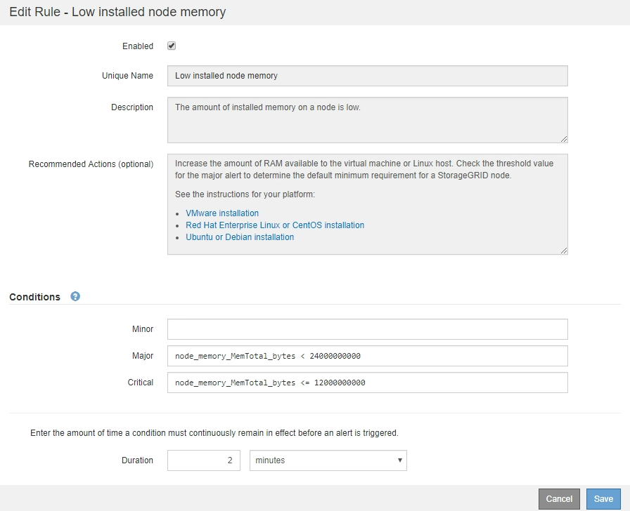

= アラートルールを編集
:allow-uri-read: 
:icons: font
:imagesdir: ../media/

[role="lead"]
アラートルールを編集してトリガー条件を変更したり、カスタムのアラートルールを使用してルール名、概要 、および推奨される対処方法を更新したりできます。

.開始する前に
* Grid Managerにサインインしておきますlink:../admin/web-browser-requirements.html["サポートされている Web ブラウザ"]。
* あなたはを持っていますlink:../admin/admin-group-permissions.html["アラートまたはRoot Access権限を管理します。"]。

.タスクの内容
デフォルトのアラートルールを編集する場合は、 Minor 、 Major 、 Critical の各アラートの条件と期間を変更できます。カスタムのアラートルールを編集する際に、ルールの名前、概要 、および推奨される対処方法を編集することもできます。

CAUTION: アラートルールを編集する場合は注意が必要です。トリガー値を変更した場合、重大な処理を完了できなくなるまで、根本的な問題が検出されないことがあります。

.手順
. *アラート* > *ルール*を選択します。
+
[Alert Rules] ページが表示されます。

. 編集するアラートルールのラジオボタンを選択します。
. [ * ルールの編集 * ] を選択します。
+
Edit Rule ダイアログボックスが表示されます。この例はデフォルトのアラートルールを示しています。[Unique Name]、概要 ]、および[Recommended Actions]のフィールドは無効になっており、編集することはできません。

+

. [有効]*チェックボックスをオンまたはオフにして、このアラートルールが現在有効になっているかどうかを確認します。
+
アラートルールを無効にすると、ルールの式は評価されず、アラートはトリガーされません。

+

NOTE: 現在のアラートのアラートルールを無効にした場合は、アラートがアクティブなアラートとして表示されなくなるまで数分待つ必要があります。

+

CAUTION: 通常は、デフォルトのアラートルールを無効にすることは推奨されません。アラートルールが無効になっている場合は、重大な処理を完了できなくなるまで、根本的な問題が検出されない可能性があります。

. カスタムのアラートルールの場合は、次の情報を必要に応じて更新します。
+

NOTE: この情報はデフォルトのアラートルールでは編集できません。

+
[cols="1a,2a"]
|===
| フィールド | 製品説明 

 a| 
一意の名前
 a| 
このルールの一意の名前。アラートルール名は、 [Alerts] ページに表示され、電子メール通知の件名にもなります。アラートルールの名前は 1~64 文字で指定できます。

 a| 
製品説明
 a| 
発生している問題の概要 。概要 は、アラートページおよび E メール通知に表示されるアラートメッセージです。アラートルールの説明は、 1~128 文字で指定できます。

 a| 
推奨される対処方法
 a| 
必要に応じて、このアラートがトリガーされたときに実行する推奨される対処方法を指定します。推奨される対処方法をプレーンテキスト（書式コードなし）で入力します。アラートルールの推奨される対処方法は、 0~1 、 024 文字で指定できます。

|===
. Conditions セクションで、 1 つ以上のアラート重大度レベルの Prometheus 式を入力または更新します。
+

NOTE: 編集したデフォルトのアラートルールの条件を元の値に戻す場合は、変更した条件の右側にある 3 つの点を選択します。

+
image::../media/alert_rules_edit_revert_to_default.png[アラートルール：編集した条件をデフォルト値に戻します]

+

NOTE: 現在のアラートの条件を更新した場合は、更新前の条件が解決されるまで変更が適用されないことがあります。ルールのいずれかの条件が次回満たされた時点で、更新された値がアラートに反映されます。

+
基本式は、通常、次の形式で指定します。

+
`[metric] [operator] [value]`

+
式の文字数に制限はありませんが、ユーザインターフェイスでは 1 行で表示されます。少なくとも 1 つの式が必要です。

+
次の式では、あるノードに搭載された RAM の容量が 24 、 000 、 000 、 000 バイト（ 24GB ）未満である場合にアラートがトリガーされます。

+
`node_memory_MemTotal_bytes < 24000000000`

. [* Duration * （時間 * ） ] フィールドに、アラートがトリガーされるまでに条件が継続的に有効である必要がある時間を入力し、時間の単位を選択します。
+
条件が true になったときにすぐにアラートをトリガーするには、「 * 0 * 」と入力します。一時的な状況でアラートがトリガーされないようにするには、この値を大きくし

+
デフォルトは5分です。

. [ 保存（ Save ） ] を選択します。
+
デフォルトのアラート・ルールを編集した場合は ' ［ タイプ ］ カラムに *Default** と表示されますデフォルトまたはカスタムのアラートルールを無効にした場合は、 * Status * 列に * Disabled * と表示されます。

