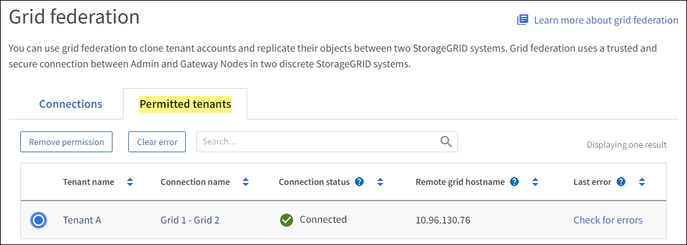

= グリッドフェデレーション接続を監視する
:allow-uri-read: 
:icons: font
:imagesdir: ../media/

[role="lead"]
すべての基本情報link:../admin/grid-federation-overview.html["グリッドフェデレーション接続"]、特定の接続に関する詳細情報、またはクロスグリッドレプリケーション処理に関するPrometheus指標を監視できます。接続はどちらのグリッドからも監視できます。

.開始する前に
* いずれかのグリッドで、を使用してGrid Managerにサインインしておきlink:../admin/web-browser-requirements.html["サポートされている Web ブラウザ"]ます。
* サインインしているグリッドのがlink:../admin/admin-group-permissions.html["rootアクセス権限"]必要です。

== すべての接続を表示します

[Grid Federation]ページには、すべてのグリッドフェデレーション接続と、グリッドフェデレーション接続の使用が許可されているすべてのテナントアカウントに関する基本的な情報が表示されます。

.手順
. *構成* > *システム* > *グリッド フェデレーション* を選択します。
+
[Grid Federation]ページが表示されます。

. このグリッド上のすべての接続に関する基本情報を表示するには、*[接続]*タブを選択します。
+
このタブでは、次の操作を実行できます。

+
** link:../admin/grid-federation-create-connection.html["新しい接続を作成します"]です。
** への既存の接続を選択しlink:../admin/grid-federation-manage-connection.html["編集またはテスト"]ます。

+
image::../media/grid-federation-connections-tab.png[グリッドフェデレーション接続タブ]

. [Use grid federation connection]*権限があるこのグリッド上のすべてのテナントアカウントに関する基本情報を表示するには、*[Permitted tenants]*タブを選択します。
+
このタブでは、次の操作を実行できます。

+
** link:../monitor/monitoring-tenant-activity.html["許可されている各テナントの詳細ページを表示します"]です。
** 各接続の詳細ページを表示します。を参照して <<view-specific-connection,特定の接続を表示します>>
** 許可されているテナントとを選択しますlink:../admin/grid-federation-manage-tenants.html["権限を削除します"]。
** グリッド間レプリケーションにエラーがないかどうかを確認し、最後のエラーがある場合はクリアします。を参照して link:../admin/grid-federation-troubleshoot.html["グリッドフェデレーションエラーをトラブルシューティングする"]
+
タブ]

== [[view-specific-connection]]特定の接続を表示します

特定のグリッドフェデレーション接続の詳細を表示できます。

.手順
. [Grid Federation]ページでいずれかのタブを選択し、テーブルから接続名を選択します。
+
接続の詳細ページでは、次の操作を実行できます。

+
** ローカルおよびリモートのホスト名、ポート、接続ステータスなど、接続に関する基本的なステータス情報を表示します。
** への接続を選択しlink:../admin/grid-federation-manage-connection.html["編集、テスト、または削除"]ます。

. 特定の接続を表示しているときに*[Permitted Tenants]*タブを選択すると、その接続で許可されているテナントに関する詳細が表示されます。
+
このタブでは、次の操作を実行できます。

+
** link:../monitor/monitoring-tenant-activity.html["許可されている各テナントの詳細ページを表示します"]です。
** link:../admin/grid-federation-manage-tenants.html["テナントの権限を削除します"]接続を使用します。
** クロスグリッドレプリケーションエラーがないかどうかを確認し、最後のエラーをクリアします。を参照して link:../admin/grid-federation-troubleshoot.html["グリッドフェデレーションエラーをトラブルシューティングする"]
+
image::../media/grid-federation-permitted-tenants-tab-for-connection.png[grid-federation-permitted-tenants-tab-for-connection]

. 特定の接続を表示している場合は、*[証明書]*タブを選択して、この接続でシステムによって生成されたサーバ証明書とクライアント証明書を表示します。
+
このタブでは、次の操作を実行できます。

+
** link:../admin/grid-federation-manage-connection.html["接続証明書をローテーションします"]です。
** 関連する証明書を表示またはダウンロードするか、証明書PEMをコピーするには、* Server *または* Client *を選択します。
+
image::../media/grid-federation-certificates-tab.png[grid-federation-certificates-tabの略]

== グリッド間レプリケーションの指標を確認します

Grafanaの[Cross-Grid Replication]ダッシュボードを使用して、グリッドでのクロスグリッドレプリケーション処理に関するPrometheus指標を表示できます。

.手順
. グリッド マネージャーから、[サポート] > [ツール] > [メトリック] を選択します。
+

NOTE: Metrics ページで使用可能なツールは、テクニカルサポートが使用することを目的としています。これらのツールの一部の機能およびメニュー項目は意図的に機能しないため、変更される場合があります。のリストを参照してくださいlink:../monitor/commonly-used-prometheus-metrics.html["よく使用される Prometheus 指標"]。

. ページの[Grafana]セクションで、*[Cross Grid Replication]*を選択します。
+
詳細については、を参照してくださいlink:../monitor/reviewing-support-metrics.html["サポート指標を確認"]。

. 複製に失敗したオブジェクトの複製を再試行するには、を参照してくださいlink:../admin/grid-federation-retry-failed-replication.html["失敗したレプリケーション処理を特定して再試行します"]。

