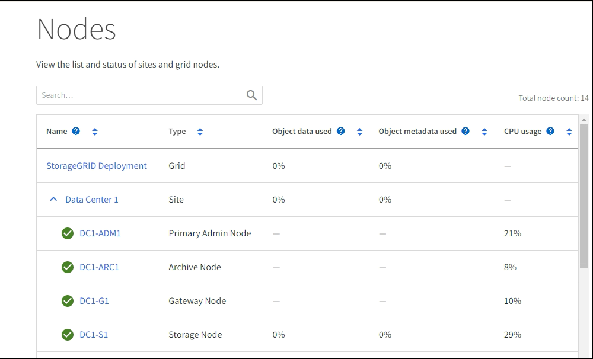

= Grid Manager の詳細を見る
:allow-uri-read: 
:icons: font
:imagesdir: ../media/

[role="lead"]
Grid Manager はブラウザベースのグラフィカルインターフェイスで、 StorageGRID システムの設定、管理、監視に使用できます。

NOTE: Grid Managerはリリースごとに更新され、このページのスクリーンショットの例とは異なる場合があります。

Grid Manager にサインインすると、管理ノードに接続されます。各 StorageGRID システムには、 1 つのプライマリ管理ノードと、任意の数のプライマリ以外の管理ノードが含まれています。どの管理ノードにも接続が可能で、各管理ノードに表示される StorageGRID システムのビューもほぼ同じです。

Grid Managerには、を使用してlink:../admin/web-browser-requirements.html["サポートされている Web ブラウザ"]アクセスできます。

== Grid Manager ダッシュボード

グリッドマネージャに初めてサインインしたときに、ダッシュボードを使用して概要を確認できますlink:../monitor/viewing-dashboard.html["システムアクティビティの監視"]。

ダッシュボードには、システムの健全性とパフォーマンス、ストレージの使用状況、ILMプロセス、S3処理、およびグリッド内のノードに関する情報が含まれています。システムを効果的に監視するために必要な情報を含むカードのコレクションから選択できますlink:../monitor/viewing-dashboard.html["ダッシュボードの設定"]。

image::../media/grid_manager_dashboard_and_menu.png[Grid Manager のダッシュボード]

各カードに表示される情報の説明については、そのカードのヘルプアイコンを選択してimage:../media/icon_nms_question.png["疑問符アイコン"]ください。

== 検索フィールド

ヘッダーバーの * Search * フィールドを使用すると、 Grid Manager 内の特定のページにすばやく移動できます。たとえば、「* km *」と入力すると、キー管理サーバ（KMS）ページにアクセスできます。

* Search * を使用して、 Grid Manager のサイドバーおよび設定、メンテナンス、サポートの各メニューでエントリを検索できます。グリッドノードやテナントアカウントなどの項目を名前で検索することもできます。

== ヘルプメニュー

ヘルプメニューimage:../media/icon-help-menu-bar.png["メニューバーのヘルプアイコン"]では、次の項目にアクセスできます。

* link:../fabricpool/use-fabricpool-setup-wizard.html["FabricPool"]およびlink:../admin/use-s3-setup-wizard.html["S3のセットアップ"]ウィザード
* 現在のリリースのStorageGRIDドキュメントセンター
* link:../admin/using-grid-management-api.html["APIドキュメント"]
* 現在インストールされているStorageGRIDのバージョンに関する情報

== ［ アラート ］ メニュー

[Alerts] メニューには、 StorageGRID の動作中に発生する可能性のある問題を検出、評価、解決するための使いやすいインターフェイスが用意されています。

[Alerts]メニューでは、次の操作を実行できlink:../monitor/managing-alerts.html["アラートの管理"]ます。

* 現在のアラートを確認します
* 解決済みのアラートを確認
* サイレンスを設定してアラート通知を停止する
* アラートをトリガーする条件のアラートルールを定義
* アラート通知用の E メールサーバを設定します

== [Nodes]ページ

にはlink:../monitor/viewing-nodes-page.html["[Nodes]ページ"]、グリッド全体、グリッド内の各サイト、およびサイトの各ノードに関する情報が表示されます。

ノードのホームページには、グリッド全体の複数の指標の合計が表示されます。特定のサイトまたはノードの情報を表示するには、サイトまたはノードを選択します。

== テナントページ

ではlink:../admin/managing-tenants.html["テナントページ"]、StorageGRIDシステムに対してを実行できますlink:../tenant/index.html["ストレージテナントアカウントを作成および監視する"]。オブジェクトの格納と読み出しを実行できるユーザを指定し、どの機能を利用可能とするかを指定するには、少なくとも 1 つのテナントアカウントを作成する必要があります。

テナントページには、使用されているストレージの容量やオブジェクトの数など、各テナントの使用状況の詳細も表示されます。テナントの作成時にクォータを設定すると、そのクォータのうちどれくらいが使用されているかを確認できます。

image::../media/tenants_page.png[[Tenants Menu and Page]]

== ILM メニュー

ではlink:using-information-lifecycle-management.html["ILM メニュー"]、データの保持方法と可用性を管理できますlink:../ilm/index.html["情報ライフサイクル管理（ILM）のルールとポリシーを設定する"]。オブジェクト ID を入力して、そのオブジェクトのメタデータを表示することもできます。

[ILM]メニューでは、ILMを表示および管理できます。

* ルール
* ポリシー
* ポリシータグ
* ストレージプール
* ストレージグレード
* 地域
* オブジェクトメタデータの検索

== 設定メニュー

[Configuration] メニューでは、ネットワーク設定、セキュリティ設定、システム設定、モニタリングオプション、およびアクセスコントロールオプションを指定できます。

=== ネットワークタスク

ネットワークタスクは次のとおりです。

* link:../admin/managing-high-availability-groups.html["ハイアベイラビリティグループの管理"]
* link:../admin/managing-load-balancing.html["ロードバランサエンドポイントの管理"]
* link:../admin/configuring-s3-api-endpoint-domain-names.html["S3エンドポイントのドメイン名を設定しています"]
* link:../admin/managing-traffic-classification-policies.html["トラフィック分類ポリシーの管理"]
* link:../admin/configure-vlan-interfaces.html["VLANインターフェイスの設定"]

=== セキュリティタスク

セキュリティタスクは次のとおりです。

* link:../admin/using-storagegrid-security-certificates.html["セキュリティ証明書の管理"]
* link:../admin/manage-firewall-controls.html["内部ファイアウォールコントロールの管理"]
* link:../admin/kms-configuring.html["キー管理サーバを設定しています"]
* link:../admin/manage-tls-ssh-policy.html["TLSおよびSSHポリシー"]、、link:../admin/changing-network-options-object-encryption.html["ネットワークとオブジェクトのセキュリティオプション"]、などのセキュリティ設定を行いますlink:../admin/changing-browser-session-timeout-interface.html["インターフェイスのセキュリティ設定"]。
* またはの設定link:../admin/configuring-storage-proxy-settings.html["ストレージプロキシ"]link:../admin/configuring-admin-proxy-settings.html["管理プロキシ"]

=== システムタスク

システムタスクは次のとおりです。

* テナントアカウント情報をクローニングし、2つのStorageGRIDシステム間でオブジェクトデータをレプリケートするために使用しますlink:../admin/grid-federation-overview.html["グリッドフェデレーション"]。
* 必要に応じて、オプションを有効にしますlink:../admin/configuring-stored-object-compression.html["格納オブジェクトを圧縮します"]。
* link:../ilm/managing-objects-with-s3-object-lock.html["S3オブジェクトロックの管理"]
* やなどのストレージオプションについてlink:../admin/what-object-segmentation-is.html["オブジェクトのセグメント化"]link:../admin/what-storage-volume-watermarks-are.html["ストレージボリュームのウォーターマーク"]
* link:../ilm/manage-erasure-coding-profiles.html["イレイジャーコーディングプロファイルの管理"]です。

=== タスクの監視

監視タスクは次のとおりです。

* link:../monitor/configure-audit-messages.html["監査メッセージとログの送信先の設定"]
* link:../monitor/using-snmp-monitoring.html["SNMPによる監視を使用する"]

=== アクセス制御タスク

アクセス制御タスクは次のとおりです。

* link:../admin/managing-admin-groups.html["管理者グループの管理"]
* link:../admin/managing-users.html["管理者ユーザの管理"]
* またはの変更link:../admin/changing-provisioning-passphrase.html["プロビジョニングパスフレーズ"]link:../admin/change-node-console-password.html["ノードコンソールのパスワード"]
* link:../admin/using-identity-federation.html["アイデンティティフェデレーションを使用する"]
* link:../admin/configuring-sso.html["SSOの設定"]

== メンテナンスメニュー

Maintenance （メンテナンス）メニューでは、メンテナンスタスク、システムメンテナンス、およびネットワークメンテナンスを実行できます。

=== タスク

保守作業には次のものが含ま

* link:../maintain/decommission-procedure.html["運用停止処理"] 未使用のグリッドノードとサイトを削除するには
* link:../expand/index.html["拡張処理"]新しいグリッドノードとサイトを追加するには
* link:../maintain/warnings-and-considerations-for-grid-node-recovery.html["グリッドノードのリカバリ手順"]障害が発生したノードを交換してデータをリストアするには
* link:../maintain/rename-grid-site-node-overview.html["プロシージャ名を変更します"]グリッド、サイト、およびノードの表示名を変更するには
* link:../troubleshoot/verifying-object-integrity.html["オブジェクトの存在チェック操作"]オブジェクトデータの有無（正確性ではない）を確認するため
* 複数のグリッドノードを再起動するためのの実行link:../maintain/rolling-reboot-procedure.html["ローリングリブート"]
* link:../maintain/restoring-volume.html["ボリュームのリストア処理"]

=== システム

実行可能なシステムメンテナンスタスクには、次のものがあります。

* link:../admin/viewing-storagegrid-license-information.html["StorageGRID ライセンス情報の表示"]またはlink:../admin/updating-storagegrid-license-information.html["ライセンス情報を更新しています"]
* の生成とダウンロードlink:../maintain/downloading-recovery-package.html["リカバリパッケージ"]
* 選択したアプライアンスでStorageGRID ソフトウェアの更新（ソフトウェアのアップグレード、ホットフィックス、SANtricity OSソフトウェアの更新など）を実行する
+
** link:../upgrade/index.html["アップグレード手順"]
** link:../maintain/storagegrid-hotfix-procedure.html["Hotfix 手順 の略"]
** https://docs.netapp.com/us-en/storagegrid-appliances/sg6000/upgrading-santricity-os-on-storage-controllers-using-grid-manager-sg6000.html["Grid Managerを使用してSG6000ストレージコントローラのSANtricity OSをアップグレードする"^]
** https://docs.netapp.com/us-en/storagegrid-appliances/sg5700/upgrading-santricity-os-on-storage-controllers-using-grid-manager-sg5700.html["Grid Managerを使用してSG5700ストレージコントローラのSANtricity OSをアップグレードする"^]

=== ネットワーク

実行できるネットワークメンテナンス作業には、次のものがあります。

* link:../maintain/configuring-dns-servers.html["DNSサーバを設定しています"]
* link:../maintain/updating-subnets-for-grid-network.html["グリッドネットワークサブネットを更新しています"]
* link:../maintain/configuring-ntp-servers.html["NTPサーバの管理"]

== サポートメニュー

Support （サポート）メニューには、テクニカルサポートがシステムの分析とトラブルシューティングに役立つオプションが表示されます。

=== ツール

[ サポート（ Support ） ] メニューの [ ツール（ Tools ） ] セクションから、次の操作を実行できます。

* link:../admin/configure-autosupport-grid-manager.html["AutoSupportの設定"]
* link:../monitor/running-diagnostics.html["診断を実行します"]グリッドの現在の状態
* link:../monitor/viewing-grid-topology-tree.html["グリッドトポロジツリーにアクセスします"]グリッドノード、サービス、および属性に関する詳細情報を表示するには
* link:../monitor/collecting-log-files-and-system-data.html["ログファイルとシステムデータを収集"]
* link:../monitor/reviewing-support-metrics.html["サポート指標を確認"]
+

NOTE: [*Metrics] オプションで使用できるツールは、テクニカル・サポートが使用することを目的としています。これらのツールの一部の機能およびメニュー項目は、意図的に機能しないようになっています。

=== アラーム（レガシー）

従来のアラームに関する情報は、このバージョンのドキュメントから削除されています。を参照してください https://docs.netapp.com/us-en/storagegrid-118/monitor/managing-alerts-and-alarms.html["アラートとアラームの管理（StorageGRID 11.8ドキュメント）"^]。

=== その他

[Support]メニューの[Other]セクションでは、次の操作を実行できます。

* 管理link:../admin/manage-link-costs.html["リンクコスト"]
* エントリの表示link:../admin/viewing-notification-status-and-queues.html["ネットワーク管理システム（ NMS ）"]
* 管理link:../admin/what-storage-volume-watermarks-are.html["ストレージのウォーターマーク"]

