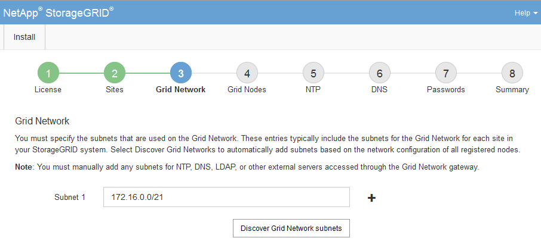

= Grid ネットワークサブネットを指定してください
:allow-uri-read: 
:icons: font
:imagesdir: ../media/

[role="lead"]
グリッドネットワークで使用されるサブネットを指定する必要があります。

.タスクの内容
サブネットエントリには、StorageGRID システム内の各サイトのグリッドネットワークのサブネット、およびグリッドネットワーク経由で到達できる必要があるサブネットが含まれます。

グリッドサブネットが複数ある場合は、グリッドネットワークゲートウェイが必要です。指定するすべてのグリッドサブネットが、このゲートウェイ経由でアクセス可能であることが必要です。

.手順
. [* サブネット 1*] テキストボックスで、少なくとも 1 つのグリッドネットワークの CIDR ネットワークアドレスを指定します。
. 最後のエントリの横にあるプラス記号をクリックして、追加のネットワークエントリを追加します。グリッドネットワーク内のすべてのサイトのすべてのサブネットを指定する必要があります。
+
** 少なくとも 1 つのノードがすでに導入されている場合は、 * グリッドネットワークのサブネットの検出 * をクリックすると、 Grid Manager に登録されているグリッドノードから報告されたサブネットが Grid ネットワークサブネットリストに自動的に追加されます。
** グリッドネットワークゲートウェイ経由でアクセスするNTP、DNS、LDAP、またはその他の外部サーバのサブネットを手動で追加する必要があります。
+

. 「 * 次へ * 」をクリックします。

