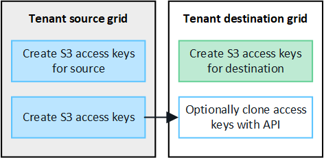

= テナントグループとテナントユーザのクローンを作成します
:allow-uri-read: 
:icons: font
:imagesdir: ../media/

[role="lead"]
グリッドフェデレーション接続を使用するようにテナントを作成または編集した場合、そのテナントは1つのStorageGRIDシステム（ソーステナント）から別のStorageGRIDシステム（レプリカテナント）にレプリケートされます。テナントがレプリケートされると、ソーステナントに追加されたすべてのグループおよびユーザがレプリカテナントにクローニングされます。

テナントが最初に作成されたStorageGRID システムは、テナントの_source grid_です。テナントがレプリケートされているStorageGRID システムは、テナントの_destination grid_です。両方のテナントアカウントに、アカウントID、名前、概要 、ストレージクォータ、および割り当てられた権限が同じである。 ただし、デスティネーションテナントには最初はrootユーザのパスワードが設定されていません。詳細については、およびを参照してくださいlink:../admin/grid-federation-what-is-account-clone.html["アカウントクローンとは何ですか"]link:../admin/grid-federation-manage-tenants.html["許可されたテナントを管理する"]。

テナントアカウント情報のクローニングは、バケットオブジェクトのに必要link:../admin/grid-federation-what-is-cross-grid-replication.html["グリッド間レプリケーション"]です。両方のグリッドに同じテナントグループとユーザが配置されているため、どちらのグリッドでも対応するバケットとオブジェクトにアクセスできます。

== アカウントクローンのテナントワークフロー

テナントアカウントに* Use grid federation connection *権限がある場合は、ワークフロー図を確認して、グループ、ユーザ、S3アクセスキーをクローニングする手順を確認してください。

image::../media/grid-federation-account-clone-workflow-tm.png[アカウントクローンのテナントのワークフロー。手順については、次のテキストで説明します。]

ワークフローの主な手順は次のとおりです。

.image:https://raw.githubusercontent.com/NetAppDocs/common/main/media/number-1.png["1つ"]テナントにサインイン
[role="quick-margin-para"]
ソースグリッド（テナントが最初に作成されたグリッド）でテナントアカウントにサインインします。

.image:https://raw.githubusercontent.com/NetAppDocs/common/main/media/number-2.png["2つ"]必要に応じてアイデンティティフェデレーションを設定
[role="quick-margin-para"]
フェデレーテッドグループとユーザを使用するための* Use own identity source *権限がテナントアカウントにある場合は、ソースとデスティネーションの両方のテナントアカウントに同じアイデンティティソース（同じ設定）を設定します。フェデレーテッドグループとフェデレーテッドユーザは、両方のグリッドで同じアイデンティティソースを使用していないかぎりクローニングできません。手順については、を参照してくださいlink:using-identity-federation.html["アイデンティティフェデレーションを使用する"]。

.image:https://raw.githubusercontent.com/NetAppDocs/common/main/media/number-3.png["3つ"]グループとユーザの作成
[role="quick-margin-para"]
グループとユーザを作成する場合は、必ずテナントのソースグリッドから開始してください。新しいグループを追加すると、StorageGRID によってデスティネーショングリッドに自動的にクローンが作成されます。

[role="quick-margin-list"]
* アイデンティティフェデレーションがStorageGRIDシステム全体またはテナントアカウントに対して設定されている場合は、link:creating-groups-for-s3-tenant.html["新しいテナントグループを作成します"]アイデンティティソースからフェデレーテッドグループをインポートします。

[role="quick-margin-list"]
* アイデンティティフェデレーションを使用していない場合はlink:creating-groups-for-s3-tenant.html["新しいローカルグループを作成します"]、をlink:managing-local-users.html["ローカルユーザを作成します"]クリックします。

.image:https://raw.githubusercontent.com/NetAppDocs/common/main/media/number-4.png["4つ"]S3アクセスキーの作成
[role="quick-margin-para"]
ソースグリッドまたはデスティネーショングリッドのいずれかでまたはを実行しlink:creating-another-users-s3-access-keys.html["別のユーザのアクセスキーを作成します"]て、そのグリッド上のバケットにアクセスできますlink:creating-your-own-s3-access-keys.html["独自のアクセスキーを作成します"]。

.image:https://raw.githubusercontent.com/NetAppDocs/common/main/media/number-5.png["5 つ"]必要に応じて、S3アクセスキーをクローニング
[role="quick-margin-para"]
両方のグリッドで同じアクセスキーを使用してバケットにアクセスする必要がある場合は、ソースグリッドでアクセスキーを作成し、Tenant Manager APIを使用してデスティネーショングリッドに手動でクローニングします。手順については、を参照してくださいlink:../tenant/grid-federation-clone-keys-with-api.html["APIを使用してS3アクセスキーをクローニングします"]。

== グループ、ユーザ、S3アクセスキーのクローニング方法

テナントソースグリッドとテナントデスティネーショングリッドの間で、グループ、ユーザ、S3アクセスキーがどのようにクローニングされるかを理解するには、このセクションを確認します。

=== ソースグリッドに作成されたローカルグループがクローニングされます

テナントアカウントが作成されてデスティネーショングリッドにレプリケートされると、StorageGRID はテナントのソースグリッドに追加したすべてのローカルグループをテナントのデスティネーショングリッドに自動的にクローニングします。

元のグループとそのクローンには、同じアクセスモード、グループ権限、S3グループポリシーが設定されています。手順については、を参照してくださいlink:creating-groups-for-s3-tenant.html["S3 テナント用のグループを作成します"]。

image::../media/grid-federation-account-clone.png[ローカルグループがソースグリッドからデスティネーショングリッドにクローニングされることを示すイメージ]

NOTE: ソースグリッドでローカルグループを作成するときに選択したユーザは、そのグループがデスティネーショングリッドにクローニングされるときに含まれません。このため、グループを作成するときにユーザーを選択しないでください。代わりに、ユーザの作成時にグループを選択します。

=== ソースグリッドに作成されたローカルユーザがクローニングされます

ソースグリッドに新しいローカルユーザを作成すると、StorageGRID によってそのユーザがデスティネーショングリッドに自動的にクローニングされます。元のユーザとそのクローンのフルネーム、ユーザ名、および* Deny access *設定が同じです。両方のユーザも同じグループに属しています。手順については、を参照してくださいlink:managing-local-users.html["ローカルユーザを管理します"]。

セキュリティ上の理由から、ローカルユーザのパスワードはデスティネーショングリッドにクローニングされません。デスティネーショングリッドでローカルユーザがTenant Managerにアクセスする必要がある場合は、テナントアカウントのrootユーザがデスティネーショングリッドでそのユーザのパスワードを追加する必要があります。手順については、を参照してくださいlink:managing-local-users.html["ローカルユーザを管理します"]。

image::../media/grid-federation-local-user-clone.png[ローカルユーザがソースグリッドからデスティネーショングリッドにクローンされていることを示すイメージ]

=== ソースグリッドに作成されたフェデレーテッドグループがクローニングされます

アカウントクローンをとlink:../admin/grid-federation-what-is-account-clone.html#account-clone-identity-federation["アイデンティティフェデレーション"]で使用するための要件が満たされている場合、link:../admin/grid-federation-what-is-account-clone.html#account-clone-sso["シングルサインオン"]ソースグリッドでテナント用に作成（インポート）するフェデレーテッドグループは、デスティネーショングリッドのテナントに自動的にクローニングされます。

両方のグループに同じアクセスモード、グループ権限、S3グループポリシーが設定されています。

ソーステナント用にフェデレーテッドグループを作成し、デスティネーションテナントにクローニングすると、フェデレーテッドユーザはどちらのグリッドからテナントにサインインできるようになります。

image::../media/grid-federation-federated-group-clone.png[フェデレーテッドグループがソースグリッドからデスティネーショングリッドにクローニングされたことを示す図]

=== S3アクセスキーは手動でクローニングできます

StorageGRID では、S3アクセスキーが自動的にクローニングされることはありません。これは、グリッドごとにキーが異なるためです。

2つのグリッドでアクセスキーを管理するには、次のいずれかを実行します。

* 各グリッドで同じキーを使用する必要がない場合は、各グリッドでまたはをlink:creating-another-users-s3-access-keys.html["別のユーザのアクセスキーを作成します"]使用できますlink:creating-your-own-s3-access-keys.html["独自のアクセスキーを作成します"]。
* 両方のグリッドで同じキーを使用する必要がある場合は、ソースグリッドでキーを作成し、Tenant Manager APIを使用してデスティネーショングリッドに手動で到達できますlink:../tenant/grid-federation-clone-keys-with-api.html["キーのクローンを作成します"]。

NOTE: フェデレーテッドユーザのS3アクセスキーをクローニングすると、ユーザとS3アクセスキーの両方がデスティネーションテナントにクローニングされます。

=== デスティネーショングリッドに追加されたグループおよびユーザはクローンされません

クローニングは、テナントのソースグリッドからテナントのデスティネーショングリッドにのみ実行されます。テナントのデスティネーショングリッドでグループとユーザを作成またはインポートした場合、StorageGRID はこれらの項目をテナントのソースグリッドにクローニングしません。

image::../media/grid-federation-account-not-cloned.png[デスティネーショングリッドの詳細がソースグリッドにクローンされていないことを示す画像]

=== 編集または削除されたグループ、ユーザ、およびアクセスキーのクローンは作成されません

クローニングは、新しいグループおよびユーザを作成した場合にのみ実行されます。

いずれかのグリッドでグループ、ユーザ、またはアクセスキーを編集または削除した場合、変更内容はもう一方のグリッドにクローニングされません。

image::../media/grid-federation-account-clone-edit-delete.png[編集または削除された詳細が複製されていないことを示す画像]
