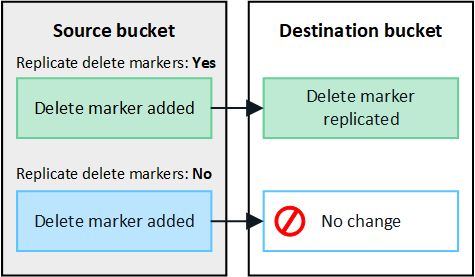

= グリッド間レプリケーションを管理します
:allow-uri-read: 
:icons: font
:imagesdir: ../media/

[role="lead"]
テナントアカウントの作成時に「Use grid federation connection *」権限が割り当てられていた場合は、グリッド間レプリケーションを使用して、テナントのソースグリッド上のバケットとテナントのデスティネーショングリッド上のバケット間でオブジェクトを自動的にレプリケートできます。グリッド間レプリケーションは、一方または両方の方向で実行できます。

== グリッド間レプリケーションのワークフロー

ワークフロー図は、2 つのグリッド上のバケット間のグリッド間レプリケーションを構成するために実行する手順をまとめたものです。これらの手順については、図の下に詳しく説明します。

image::../media/grid-federation-cgr-workflow.png[グリッド間レプリケーションのワークフロー]

== グリッド間レプリケーションを設定する

クロスグリッド レプリケーションを使用する前に、各グリッドの対応するテナント アカウントにサインインし、2 つのバケットを作成する必要があります。次に、いずれかまたは両方のバケットでクロスグリッド レプリケーションを有効にできます。

.開始する前に
* クロスグリッド レプリケーションの要件を確認しました。。 link:../admin/grid-federation-what-is-cross-grid-replication.html["クロスグリッドレプリケーションとは"] 。
* 使用していますlink:../admin/web-browser-requirements.html["サポートされている Web ブラウザ"]。
* テナント アカウントには *グリッド フェデレーション接続を使用する* 権限があり、両方のグリッドに同一のテナント アカウントが存在します。。 link:../admin/grid-federation-manage-tenants.html["グリッドフェデレーション接続に許可されているテナントを管理します"] 。
* サインインしようとしているテナントユーザーは、両方のグリッドに既に存在し、link:tenant-management-permissions.html["rootアクセス権限"] 。
* テナントの宛先グリッドにローカル ユーザーとしてサインインしている場合、テナント アカウントのルート ユーザーがそのグリッド上のユーザー アカウントのパスワードを設定しています。

=== 2つのバケットを作成する

最初のステップとして、各グリッドの対応するテナント アカウントにサインインし、各グリッドにバケットを作成します。

.手順
. グリッドフェデレーション接続のいずれかのグリッドから、新しいバケットを作成します。
+
.. 両方のグリッドに存在するテナントユーザのクレデンシャルを使用してテナントアカウントにサインインします。
+
ローカル ユーザーとしてテナントの宛先グリッドにサインインできない場合は、テナント アカウントのルート ユーザーがユーザー アカウントのパスワードを設定していることを確認します。

.. の指示に従ってくださいlink:creating-s3-bucket.html["S3バケットを作成"]。
+

TIP: バケット名とリージョンはグリッドごとに異なる場合があります。

.. [オブジェクト設定の管理]*タブで、*[オブジェクトのバージョン管理を有効にする]*を選択します。
.. StorageGRIDシステムでS3オブジェクトロックが有効になっている場合は、link:../admin/grid-federation-what-is-cross-grid-replication.html#cgr-with-ol["S3 オブジェクトロックを使用したクロスグリッドレプリケーション"] 。
.. [ * バケットの作成 * ] を選択します。
.. [ 完了 ] を選択します。

. これらの手順を繰り返して、グリッド フェデレーション接続内の他のグリッド上の同じテナント アカウントのバケットを作成します。
+

TIP: 必要に応じて、各バケットで異なるリージョンを使用できます。

=== グリッド間レプリケーションを有効にする

これらの手順は、いずれかのバケットにオブジェクトを追加する前に実行する必要があります。

.手順
. オブジェクトを複製するグリッドから開始して、link:../admin/grid-federation-what-is-cross-grid-replication.html["一方向のグリッド間レプリケーション"]次を有効にします。
+
.. バケットのテナントアカウントにサインインします。
.. ダッシュボードで* View Buckets *を選択するか、* storage（S3）*>* Buckets *を選択します。
.. 表からバケット名を選択して、バケットの詳細ページにアクセスします。
.. [クロスグリッドレプリケーション]*タブを選択します。
.. [有効化]*を選択し、要件のリストを確認します。
.. すべての要件を満たしている場合は、使用するグリッドフェデレーション接続を選択します。
.. 必要に応じて、[Replicate delete markers]の設定を変更して、S3クライアントがバージョンIDを含まない削除要求をソースグリッドに対して実行した場合のデスティネーショングリッドでの動作を確認します。
+
*** * Yes *（デフォルト）：削除マーカーがソースバケットに追加され、デスティネーションバケットにレプリケートされます。
*** *いいえ*: 削除マーカーはソースバケットに追加されますが、宛先バケットには複製されません。
+

+

NOTE: 削除リクエストにバージョン ID が含まれている場合、そのオブジェクト バージョンはソース バケットから完全に削除されます。  StorageGRID はバージョン ID を含む削除要求を複製しないため、同じオブジェクト バージョンが宛先から削除されません。

+
参照link:../admin/grid-federation-what-is-cross-grid-replication.html["クロスグリッドレプリケーションとは"]詳細については。

.. 必要に応じて、*クロスグリッドレプリケーション*監査カテゴリの設定を変更して、監査メッセージの量を管理します。
+
*** *エラー*（デフォルト）：失敗したグリッド間レプリケーション要求のみが監査出力に含まれます。
*** * Normal *：グリッドをまたぐレプリケーション要求がすべて含まれるため、監査出力の量が大幅に増加します。

.. 選択内容を確認します。両方のバケットが空でない限り、これらの設定を変更することはできません。
.. [有効にしてテスト]*を選択します。
+
しばらくすると、成功メッセージが表示されます。このバケットに追加されたオブジェクトは、他のグリッドに自動的に複製されるようになりました。  *クロスグリッド レプリケーション* は、バケットの詳細ページで有効な機能として表示されます。

. 必要に応じて、もう一方のグリッドの対応するバケットに移動しlink:../admin/grid-federation-what-is-cross-grid-replication.html["双方向のグリッド間レプリケーションを有効にします"]ます。

== グリッド間のレプリケーションをテスト

バケットでクロスグリッドレプリケーションが有効になっている場合は、接続とグリッド間レプリケーションが正しく機能していること、ソースとデスティネーションのバケットがすべての要件を満たしていること（バージョン管理が有効になっている場合など）を確認する必要があります。

.開始する前に
* 使用していますlink:../admin/web-browser-requirements.html["サポートされている Web ブラウザ"]。
* が設定されたユーザグループに属しているlink:tenant-management-permissions.html["rootアクセス権限"]必要があります。

.手順
. バケットのテナントアカウントにサインインします。
. ダッシュボードで* View Buckets *を選択するか、* storage（S3）*>* Buckets *を選択します。
. 表からバケット名を選択して、バケットの詳細ページにアクセスします。
. [クロスグリッドレプリケーション]*タブを選択します。
. [ 接続のテスト * ] を選択します。
+
接続が正常な場合は、成功バナーが表示されます。それ以外の場合はエラー メッセージが表示され、グリッド管理者はそのメッセージを使用して問題を解決できます。詳細については、link:../admin/grid-federation-troubleshoot.html["グリッドフェデレーションエラーをトラブルシューティングする"] 。

. グリッド間レプリケーションが両方向で実行されるように設定されている場合は、もう一方のグリッドの対応するバケットに移動して*[Test connection]*を選択し、グリッド間レプリケーションが反対方向で動作していることを確認します。

== グリッド間レプリケーションを無効にします

オブジェクトをもう一方のグリッドにコピーする必要がなくなった場合は、グリッド間レプリケーションを永続的に停止できます。

グリッド間レプリケーションを無効にする前に、次の点に注意してください。

* グリッド間のレプリケーションを無効にしても、グリッド間ですでにコピーされているオブジェクトは削除されません。例えば、 `my-bucket`グリッド1にコピーされた `my-bucket`グリッド 2 のバケットのクロスグリッド レプリケーションを無効にしても、そのバケットのクロスグリッド レプリケーションは削除されません。これらのオブジェクトを削除する場合は、手動で削除する必要があります。
* 各バケットでグリッド間レプリケーションが有効になっている場合（双方向でレプリケーションが発生した場合）は、一方または両方のバケットでグリッド間レプリケーションを無効にすることができます。たとえば、グリッド1からグリッド2へのオブジェクトのレプリケーションを無効にしながら、グリッド2から `my-bucket`グリッド1への `my-bucket`オブジェクトのレプリケーションを `my-bucket`続行 `my-bucket`できます。
* グリッド フェデレーション接続を使用するためのテナントの権限を削除する前に、クロス グリッド レプリケーションを無効にする必要があります。。 link:../admin/grid-federation-manage-tenants.html["許可されたテナントを管理する"] 。
* オブジェクトを含むバケットのクロスグリッド レプリケーションを無効にすると、ソース バケットと宛先バケットの両方からすべてのオブジェクトを削除しない限り、クロスグリッド レプリケーションを再度有効にすることはできません。
+

CAUTION: 両方のバケットが空でない限り、レプリケーションを再度有効にすることはできません。

.開始する前に
* 使用していますlink:../admin/web-browser-requirements.html["サポートされている Web ブラウザ"]。
* が設定されたユーザグループに属しているlink:tenant-management-permissions.html["rootアクセス権限"]必要があります。

.手順
. レプリケートするオブジェクトが含まれていないグリッドから、バケットのグリッド間レプリケーションを停止します。
+
.. バケットのテナントアカウントにサインインします。
.. ダッシュボードで* View Buckets *を選択するか、* storage（S3）*>* Buckets *を選択します。
.. 表からバケット名を選択して、バケットの詳細ページにアクセスします。
.. [クロスグリッドレプリケーション]*タブを選択します。
.. [レプリケーションを無効にする]*を選択します。
.. このバケットのクロスグリッド レプリケーションを無効にする場合は、テキスト ボックスに「*はい*」と入力し、「*無効*」を選択します。
+
しばらくすると、成功のメッセージが表示されます。このバケットに追加された新しいオブジェクトを他のグリッドに自動的にレプリケートすることはできなくなります。*クロスグリッドレプリケーション*は、[Buckets]ページに有効な機能として表示されなくなりました。

. グリッド間レプリケーションが双方向で実行されるように設定されている場合は、もう一方のグリッドの対応するバケットに移動し、別の方向へのグリッド間レプリケーションを停止します。

