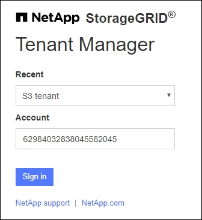

= Tenant Manager にサインインします
:allow-uri-read: 
:icons: font
:imagesdir: ../media/

[role="lead"]
Tenant Managerにアクセスするには、のアドレスバーにテナントのURLを入力しlink:../admin/web-browser-requirements.html["サポートされている Web ブラウザ"]ます。

.開始する前に
* ログインクレデンシャルが必要です。
* Tenant ManagerにアクセスするためのURLを、グリッド管理者から入手しておきます。URL は次のいずれかの例のようになります。
+
`\https://FQDN_or_Admin_Node_IP/`

+
`\https://FQDN_or_Admin_Node_IP:port/`

+
`\https://FQDN_or_Admin_Node_IP/?accountId=20-digit-account-id`

+
`\https://FQDN_or_Admin_Node_IP:port/?accountId=20-digit-account-id`

+
URLには、必ず完全修飾ドメイン名（FQDN）、管理ノードのIPアドレス、または管理ノードのHAグループの仮想IPアドレスが含まれます。ポート番号、20桁のテナントアカウントID、またはその両方を指定することもできます。

* URLに20桁のテナントアカウントIDが含まれていない場合は、このアカウントIDが必要です。
* を使用しているlink:../admin/web-browser-requirements.html["サポートされている Web ブラウザ"]。
* Web ブラウザでクッキーが有効になっている必要があります。
* ユーザは、のユーザグループに属してlink:tenant-management-permissions.html["特定のアクセス権限"]います。

.手順
. を起動しlink:../admin/web-browser-requirements.html["サポートされている Web ブラウザ"]ます。
. ブラウザのアドレスバーに、 Tenant Manager にアクセスするための URL を入力します。
. セキュリティアラートが表示された場合は、ブラウザのインストールウィザードを使用して証明書をインストールします。
. Tenant Manager にサインインします。
+
表示されるサインイン画面は、入力したURLと、StorageGRID 用にシングルサインオン（SSO）が設定されているかどうかによって異なります。

+
[role="tabbed-block"]
====
.SSOを使用しない
--
StorageGRID がSSOを使用していない場合は、次のいずれかの画面が表示されます。

** Grid Manager のサインインページが表示されます。[Tenant sign-in]*リンクを選択します。
+
image::../media/tenant_login_link.png[Grid Managerのサインインページにあるテナントのサインインリンク]

** Tenant Manager のサインインページが表示されます。[Account]*フィールドは、次のようにすでに入力されている場合があります。
+
image::../media/tenant_user_sign_in.png[Tenant Manager のサインインページ]

+
... テナントの 20 桁のアカウント ID が表示されない場合は、最近のアカウントのリストにテナントアカウントが表示されている場合はその名前を選択するか、アカウント ID を入力します。
... ユーザ名とパスワードを入力します。
... 「サインイン」を選択します。
+
Tenant Managerダッシュボードが表示されます。

... 他のユーザーから初期パスワードを受け取った場合は、*_ username_*>* Change password *を選択してアカウントを保護します。

--
.SSOを使用する
--
StorageGRID がSSOを使用している場合は、次のいずれかの画面が表示されます。

** 組織のSSOページ。例：
+
image::../media/sso_organization_page.gif[SSO の組織のサインインページの例]

+
標準のSSOクレデンシャルを入力し、*[サインイン]*を選択します。

** Tenant Manager の SSO サインインページ。
+

+
... テナントの 20 桁のアカウント ID が表示されない場合は、最近のアカウントのリストにテナントアカウントが表示されている場合はその名前を選択するか、アカウント ID を入力します。
... 「サインイン」を選択します。
... 組織の SSO サインインページで通常使用している SSO クレデンシャルを使用してサインインします。
+
Tenant Managerダッシュボードが表示されます。

--
====

